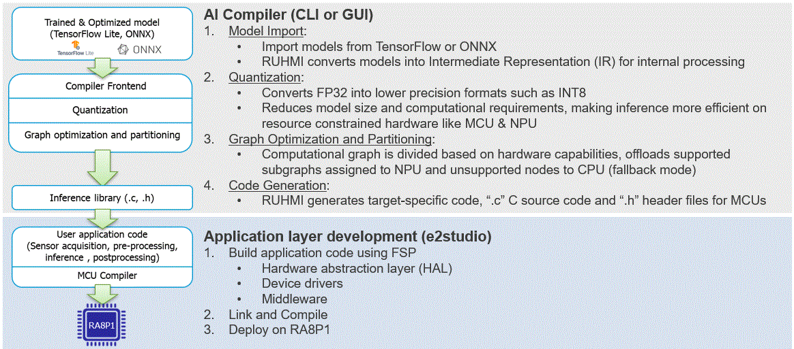

# RUHMI, Robust Unified Heterogeneous Model Integration, Framework supports AI model optimization and deployment with powered by EdgeCortix© MERA™.

## License
(C) Copyright EdgeCortix, Inc. 2025 (C) Copyright Renesas Electronics Corporation 2025 Contributors Licensed under [each license](LICENSE.md).  

## Introduction
RUHMI Framework povides a compiler and the necessary tools to convert machine learning models into C source code compatible with range of Renesas MCUs powered by Arm Ethos-U NPUs.
The software stack generates C source code while ensuring compatibility and tight integration the with Renesas e2 studio.
It also ships with Quantizer, a post-training static INT8 quantizer, allowing more demanding models to meet the memory and latency constraints typical of microcontrollers and Ethos-U accelerators.

## RUHMI Framework workflow

## Supported embedded platforms  
  • Renesas MCU RA8P1 series   

## Installation - Ubuntu Linux
In order to install RUHMI Framework on supported environment you will need:  
  • A machine with Ubuntu 22.04 installation is recommended as this was the version used for testing  
  • A working installation of PyEnv or other Python virtual environment management system that provides Python version 3.10.x.  

[Installation Guide](/install/README.md)

## Installation - Windows
The software stack is also provided as PIP package compatible with Windows 11.
In order to install RUHMI Framework on supported environment you will need:  
• A machine with Windows 10 or 11. Windows 11 is recommended as this was the version used for testing   
• A working installation of PyEnv or other Python virtual environment management system that provides Python version 3.10.x.  
• Microsoft C++ runtime libraries   

  [Installation Guide](/install/README.md)

## Sample scripts
Same cases are introduced with the sample script.

Example case:
* Deploy models  
  Deploy to CPU only   
  Deploy to CPU with Ethos U55 supported    
* Quantize and deploy models  
  Deploy to CPU only   
  Deploy to CPU with Ethos U55 supported    

   [The detailed description of how to use the scripts](scripts/README.md)

## Guide to the generated C source code
After processing a model, you will find several files on your deployment directory. This include some deploying artifacts generated during compilation that are worth to be kept around for debugging purposes.
The most important output is found under the directory **<deployment_directory>build/MCU/compilation/src**. 
This directory contains the model converted into a set of C99 source code files.
You can refer to [how to use runtime API](doc/runtime_api.md)

## AI model compiler API Specification  
You might want to see the cutermised method to quantize and to optimise your model with your good expertise. For your needs, you can refer to the API specification for the model compiler.
  [AI model compiler API](doc/mera_api.html)

## Support  
### Error List  
If error occurred at compile/runtime operation, please refer [error list](./doc/error_list.md).  

### Limitation  
There are some known constraints of the functions, Quatizer and C-Codegen.
Please see [LIMITATIONS](LIMITATIONS.md).

### Enquiries  
If you have any questions, please contact [Renesas Technical Support](https://www.renesas.com/support).  
You can also leverage [issues](https://github.com/Masamitsu1025/ruhmi-framework-mcu/issues).

