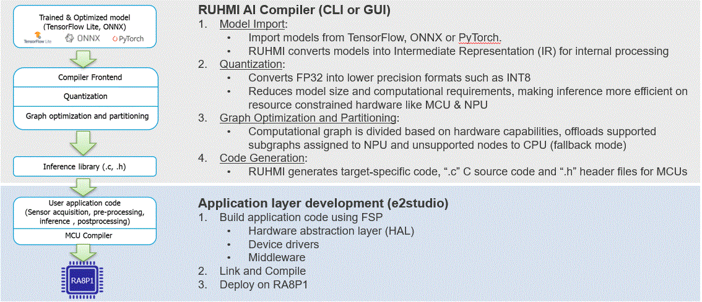

# RUHMI Framework AI Compiler for MCU

**Robust Unified Heterogeneous Model Integration** - A framework for AI model optimization and deployment, this GitHub provides the AI MCU Compiler for Renesas embedded platforms powered by EdgeCortix® MERA™.

[](LICENSE.md)
[]()
[]()

## Introduction

RUHMI Framework[^1] provides a compiler and the necessary tools to convert machine learning models into C source code compatible with a range of Renesas MCUs powered by Arm Ethos-U NPUs.
The software stack generates C source code while ensuring compatibility and tight integration with Renesas e2 studio.
It also ships with Mera Quantizer, a post-training static INT8 quantizer, allowing more demanding models to meet the memory and latency constraints typical of microcontrollers and Ethos-U accelerators.

[^1]: RUHMI Framework's AI Compiler is powered by EdgeCortix® MERA™.

## RUHMI Framework Workflow



## Quick Start

Get up and running in 5 steps (Ubuntu Linux / WSL):

```bash
# 1. Clone the repository
git clone https://github.com/renesas/ruhmi-framework-mcu.git
cd ruhmi-framework-mcu

# 2. Create and activate virtual environment
python3.10 -m venv mera-env
source mera-env/bin/activate

# 3. Install dependencies and MERA
pip install --upgrade pip
pip install decorator typing_extensions psutil attrs pybind11 cmake junitparser
pip install ./install/mera-2.5.0+pkg.3577-cp310-cp310-manylinux_2_27_x86_64.whl

# 4. Download a sample model
wget https://raw.githubusercontent.com/mlcommons/tiny/master/benchmark/training/anomaly_detection/trained_models/ad01_int8.tflite
mkdir -p models_int8 && mv ad01_int8.tflite models_int8/

# 5. Deploy the model to C code
cd scripts
python mcu_deploy.py --ethos --ref_data ../models_int8 ../deploy_output
```

Your compiled C source code will be in `deploy_output/ad01_int8_no_ospi/build/MCU/compilation/src/`.

📖 For detailed installation instructions, see the [Installation Guide](install/README.md).


## Supported Embedded Platforms

- Renesas MCU RA8P1 series
- Renesas MCU RA8xx series (non-NPU devices)

## Installation

RUHMI supports Ubuntu Linux and Windows. The table below outlines the prerequisites for each platform.

| Requirement | Ubuntu Linux | Windows |
|-------------|--------------|----------|
| **OS Version** | Ubuntu 22.04 (recommended) | Windows 10 or 11 (11 recommended) |
| **Python** | Python 3.10.x via PyEnv or venv | Python 3.10.x via PyEnv or venv |
| **Additional** | — | Microsoft C++ runtime libraries |

📖 For detailed installation instructions, refer to the [Installation Guide](/install/README.md).

## Model Compilation

Sample scripts are provided for common use cases:

**Deploy models:**
- Deploy to CPU only
- Deploy to CPU with Ethos-U55 support

**Quantize and deploy models:**
- Deploy to CPU only
- Deploy to CPU with Ethos-U55 support

📖 [Detailed guide on executing model compilation with sample scripts](scripts/README.md)

## Guide to the Generated C Source Code

After processing a model, you will find several files in your deployment directory. This includes some deployment artifacts generated during compilation that are worth keeping for debugging purposes.

The most important output is found under the directory `<deployment_directory>/build/MCU/compilation/src`.
This directory contains the model converted into a set of C99 source code files.

📖 [Guide to the generated C source code](docs/runtime_api.md)

## Documentation

| Document | Description |
|----------|-------------|
| [AI Model Compiler API](https://renesas.github.io/ruhmi-framework-mcu/mera_api.html) | API specification for AI Compiler python library|
| [Operator Support](docs/operator_support.md) | Supported operators for each frontend framework |
| [Visualizer](docs/visualizer/README.md) | Model graph visualization tool |
| [Benchmark](docs/benchmark/README.md) | Performance benchmarking guide to measure inference on RA8xx |
| [Models Tested](docs/models_tested.md) | List of tested models |
| [Tips](docs/tips.md) | Troubleshooting common warnings and issues |
| [Error List](docs/error_list.md) | Compile/runtime error references |

## Inquiries

If you have any questions, please contact [Renesas Technical Support](https://www.renesas.com/support) or open an [issue](https://github.com/renesas/ruhmi-framework-mcu/issues) on GitHub.
