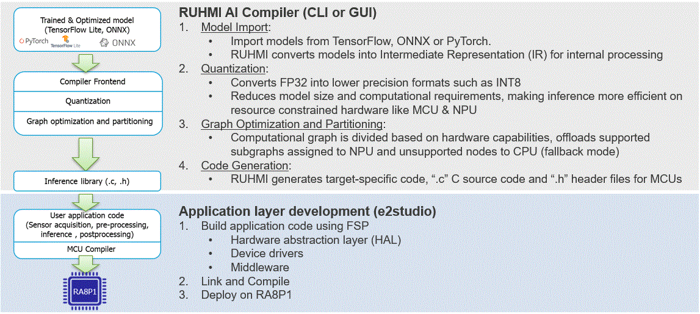

# RUHMI (Robust Unified Heterogeneous Model Integration) is a framework for AI model optimization and deployment, powered by EdgeCortix® MERA.

## Introduction
RUHMI Framework[^1] povide a compiler and the necessary tools to convert machine learning models into C source code compatible with range of Renesas MCUs powered by Arm Ethos-U NPUs.
The software stack generates C source code while ensuring compatibility and tight integration the with Renesas e2 studio.
It also ships with Quantizer, a post-training static INT8 quantizer, allowing more demanding models to meet the memory and latency constraints typical of microcontrollers and Ethos-U accelerators.

[^1]: RUHMI Framework is powered by EdgeCortix® MERA™.

## RUHMI Framework[^1] workflow

## Supported embedded platforms  
  • Renesas MCU RA8P1 series   

## Supported operating systems  
RUHMI supports two operating systems. This section outlines the prerequisites. For detailed installation instructions, refer to [Installation Guide](/install/README.md).

## Installation - Ubuntu Linux
In order to install RUHMI Framework on supported environment you will need:  
  • A machine with Ubuntu 22.04 installation is recommended as this was the version used for testing  
  • A working installation of PyEnv or other Python virtual environment management system that provides Python version 3.10.x.  

## Installation - Windows
The software stack is also provided as PIP package compatible with Windows 11.
In order to install RUHMI Framework on supported environment you will need:  
• A machine with Windows 10 or 11. Windows 11 is recommended as this was the version used for testing   
• A working installation of PyEnv or other Python virtual environment management system that provides Python version 3.10.x.  
• Microsoft C++ runtime libraries   

## Model compilation  
Same cases are introduced with the sample script.

Example case:
* Deploy models  
  - Deploy to CPU only   
  - Deploy to CPU with Ethos U55 supported    
* Quantize and deploy models  
  - Deploy to CPU only   
  - Deploy to CPU with Ethos U55 supported    

   [The detailed description of how to execute model compilation with the sample scripts](scripts/README.md)

## Guide to the generated C source code
After processing a model, you will find several files on your deployment directory. This include some deploying artifacts generated during compilation that are worth to be kept around for debugging purposes.
The most important output is found under the directory `<deployment_directory>build/MCU/compilation/src`. 
This directory contains the model converted into a set of C99 source code files.
You can refer to [Guide to the generated C source code](docs/runtime_api.md)

## AI model compiler API Specification  
You might want to see the custermised method to quantize and to optimise your model with your good expertise. For your needs, you can refer to the API specification for the model compiler.
  [AI model compiler API](https://renesas.github.io/ruhmi-framework-mcu/mera_api.html)

## Support 

### Operator support 
Please refer to the following [operators directory](/docs/operator_support.md) to understand what operators are supported by the framework.

### Tips  
If you see any warnings in the process of installation and running the sample scripts, you can refer [Tips](./docs/tips.md)  

### Limitation  
There are some known constraints of the functions, Quatizer and C-Codegen.
Please see [LIMITATIONS](./docs/LIMITATIONS.md).

### Error List  
If error occurred at compile/runtime operation, please refer [error list](./docs/error_list.md).  

### Enquiries  
If you have any questions, please contact [Renesas Technical Support](https://www.renesas.com/support).  
You can also leverage [issues](https://github.com/renesas/ruhmi-framework-mcu/issues).

