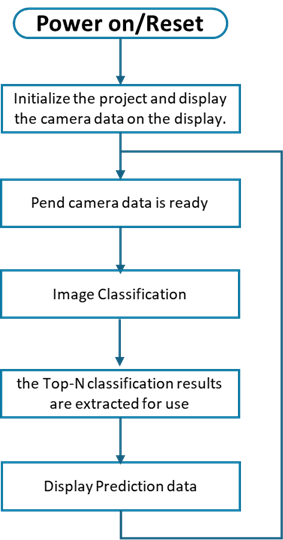
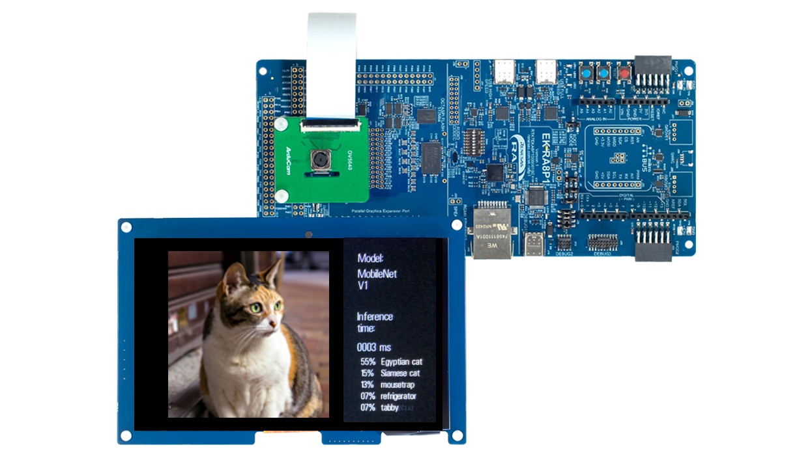

# Introduction

This demo showcases an image classification application using MobileNet_v1 on the Renesas RA8P1 MCU with Arm Ethos-U55 support. It leverages the RUHMI Framework for efficient model deployment. Real-time inference is performed on camera input, and the top-5 classification results are displayed on an LCD, demonstrating low-power, high-performance edge AI capabilities. 

| No   | Content            | Description      |
| ---- | --------------- | --------- |
|1|AI Model|mobilenetv1|
|2|Inference time|Displays inference time in milliseconds|
|3|TOP 5 accuracy|The Top-5 predicted class labels along with their confidence scores on the screen|

    

Power on the EK-RA8P1 Kit with any of the USB connectors that are available.  
The Image Classification operation is demonstrated in renesas.com/EK-RA8P1  

