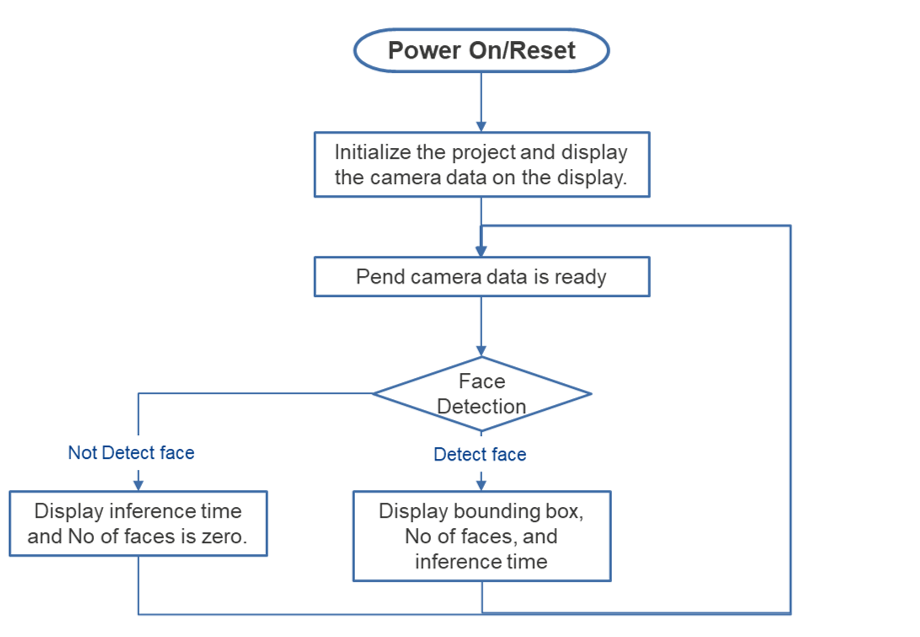
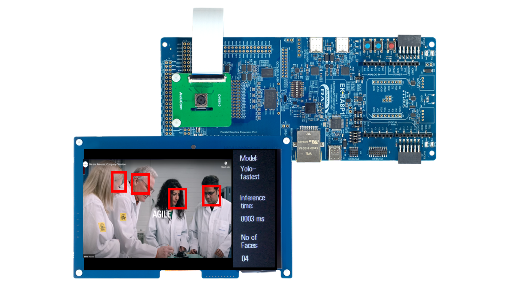

# Introduction

This demo project showcases face detection on a Renesas RA8 microcontroller using the RUHMI Framework. A camera captures images, and a lightweight neural network detects faces in real time. Results are displayed on an LCD with bounding boxes. The project demonstrates efficient AI inference and processing on embedded systems

| No   | Content            | Description      |
| ---- | --------------- | --------- |
|1|AI Model|Yolo-fastest|
|2|Inference time|Displays inference time in milliseconds|
|3|Num of face|Count the number of faces|

    

Power on the EK-RA8P1 Kit with any of the USB connectors that are available.  
The Image Classification operation is demonstrated in renesas.com/EK-RA8P1  

