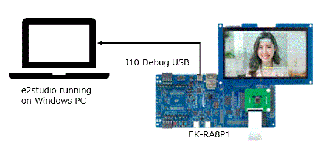
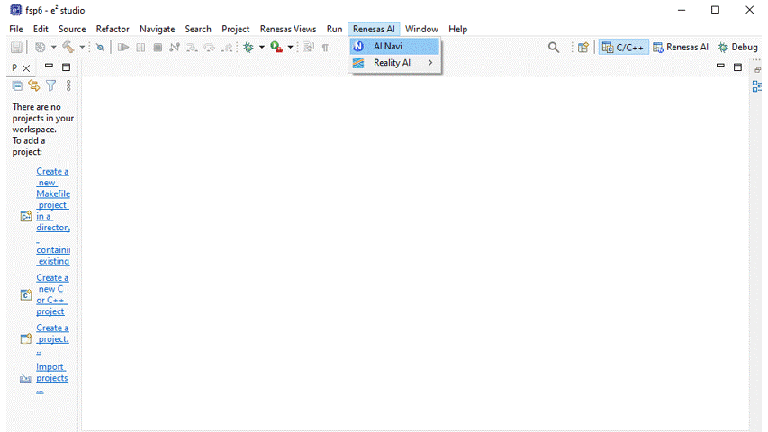
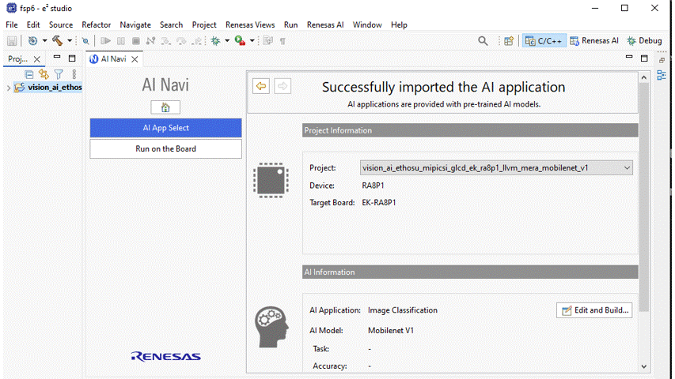
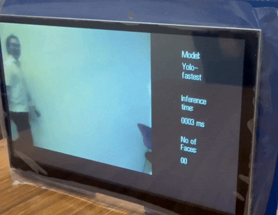
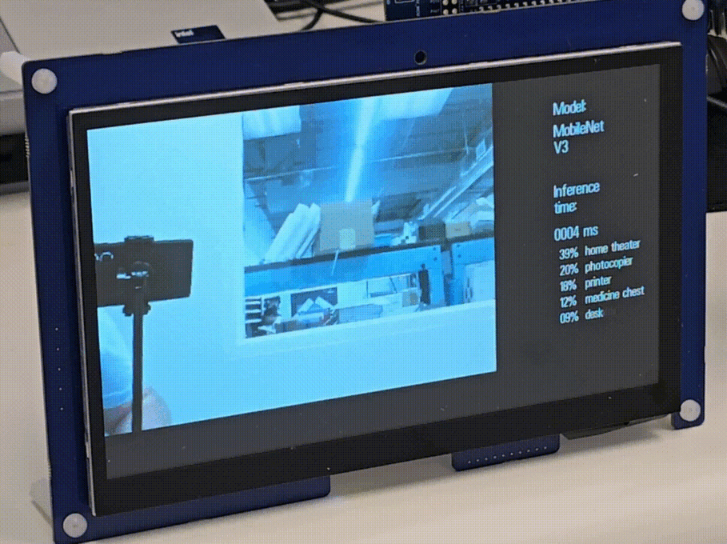
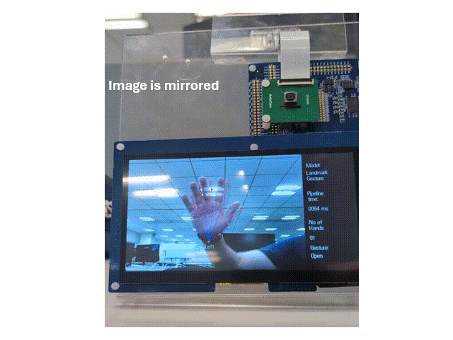

# EK-RA8P1 Quick Setup Overview  

## Preparing EK-RA8P1 and the system configuration  

### Hardware Requirements  
•	[EK-RA8P1 board](https://www.renesas.com/en/design-resources/boards-kits/ek-ra8p1?srsltid=AfmBOoqu5uHQpXJIfZmN9Pxmy2cGa02Nq_9w-2t3bX80hAutKFUQwCch)  
•	OV5640 Camera module  
•	Display  
•	USB-C cable   
•	A PC with at least 1 USB port  

### Software Requirements  
- Windows® 10 or 11 operating system 
- **e² studio version**: Version: 2026-07        
- **Flexible Software Package (FSP)**: 6.6.0  

### Connecting and Powering Up the EK-RA8P1 Board  
1.	Attach the Camera module   
2.	Attach the display  
3.	Connect the USB-C  cable to USB-C  (J10) of the EK-RA8P1 board.  
4.	Connect the other end of this cable to the USB port of the host PC. When powered, the white LED near the center of the board (the “dash” in the EK-RA8P1 name) will light up.   

## Downloading sample AI Application and run  

### Launch AI Navigator and Import sample AI Application.  

 

 
### Compile the sample application and load artifact to EK-RA8P1

  

# Demo movies  

<table>
  <tr>
    <td align="center">
      <h3>Face detection</h3>
      
    </td>
  </tr>
  <tr>
    <td align="center">
      <h3>Image classification</h3>
      
    </td>
  </tr>
  <tr>
    <td align="center">
      <h3>Hand landmark</h3>
      
    </td>
  </tr>
</table>

