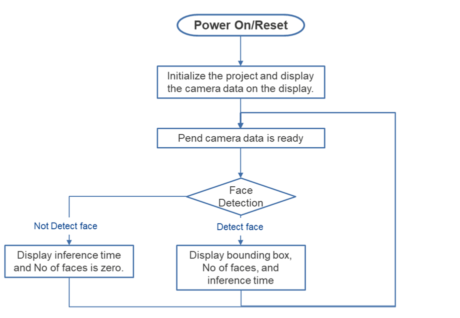
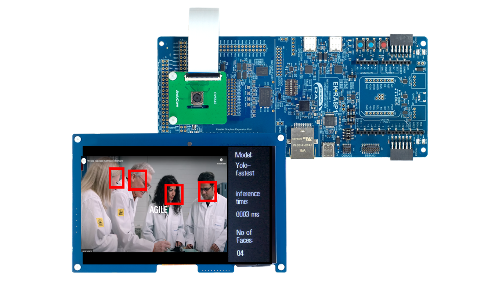

# Introduction
This demo project showcases face detection on a Renesas RA8 microcontroller using the RUHMI Framework. A camera captures images, and a lightweight neural network detects faces in real time. Results are displayed on an LCD with bounding boxes. The project demonstrates efficient AI inference and processing on embedded systems

---

## Overview
The system captures camera frames, detects faces, and draws bounding boxes over detected regions. The primary goal is to demonstrate efficient AI processing using Ethos-U NPU on an embedded platform with real-time constraints.

| No   | Content            | Description      |
| ---- | --------------- | --------- |
|1|AI Model|Yolo-fastest|
|2|Inference time|Displays inference time in milliseconds|
|3|Num of face|Count the number of faces|

<div align="center">
    


<div align="left">
The Image Classification operation is demonstrated in renesas.com/EK-RA8P1  

---

## [Hardware Setup](https://github.com/Masamitsu1025/ruhmi-framework-mcu/tree/add_example_projects/application_examples)
- **Evaluation Kit**: Renesas **EK-RA8P1**
- **Camera & Display**: Integrated in the EK-RA8P1 kit
- **NPU**: On-board **Arm Ethos-U** (no external setup required)
- **Connection to PC**: Power on the EK-RA8P1 Kit with any of the USB connectors that are available.  
- **Important**: Ensure the **SW4 switch (middle of the board)** is set to all **0** (OFF)  
  > (See right image above for reference)

---

## Software Setup

- **e² studio version**: 2025-04.1  
- **Flexible Software Package (FSP)**: 6.0.0  
  > FSP 6.0.0 is bundled with e² studio 2025-04.1 and installed by default.
- **mera framework**: Included in this repository

## How to Compile and Flash

1. **Install e² studio 2025-04.1**
2. **Connect your EK-RA8P1 board** via USB Type-C
3. **Download this repository and extract**
3. **Open e² studio** and import this project: `File` -> `Import` -> `Existing Projects into Workspace`
4. **Generate drivers**: Double click `configuration.xml` -> `Generate Project Content`
5. **Build the Project**:
    - `Right click the project name in left side bar` -> `Build Project`
6. **Flash to Board**:
    - `Right click the project name in left side bar` -> `Debug As` -> `Renesas GDB Hardware Debugging`.
7. **Run the binary**
    - Click `Resume` button several times
---
## Key Source Code

Main AI inference logic is in:
`<project_root/src/ai_application/face_detection/MainLoop_obj.cc> (from line 105)
`

## Code Explanation:

```cpp
memcpy(mera_input_ptr(), model_buffer_int8, model_image_input_SIZE);
```
* Prepares the input data for inference by copying it into the memory area expected by the mera framework.

```cpp
volatile uint32_t old_counter = TimeCounter_CurrentCountGet();
mera_invoke();
volatile uint32_t new_counter = TimeCounter_CurrentCountGet();
```
* Measures inference time using a timer.
* `mera_invoke()` is the actual function that performs inference using Ethos-U (if enabled).

```cpp
volatile uint32_t diff = new_counter - old_counter;
application_processing_time.ai_inference_time_ms = TimeCounter_CountValueConvertToMs(old_counter, new_counter);
```
* Calculates the AI processing time in milliseconds and stores it in a global variable.

```cpp
    int8_t* output0 = (int8_t*)mera_output1_ptr();
    int8_t* output1 = (int8_t*)mera_output2_ptr();
```
Retrieves the pointer to the output buffer, they contain the model's results for post-processing (e.g. bounding box coordinates, scores, etc.).

## Results & Performance

| Mode             | Inference Time |          Notes           |
|------------------|-----------|-------------------------------|
| Ethos-U enabled  |    4ms    | NPU accelerated inference     |
| Ethos-U disabled |    74ms   | Software fallback only        |


## Model reference
Model used for this project is YOLO_fastest_192 and can be downloaded from [here](https://github.com/emza-vs/ModelZoo/tree/master/object_detection) 


