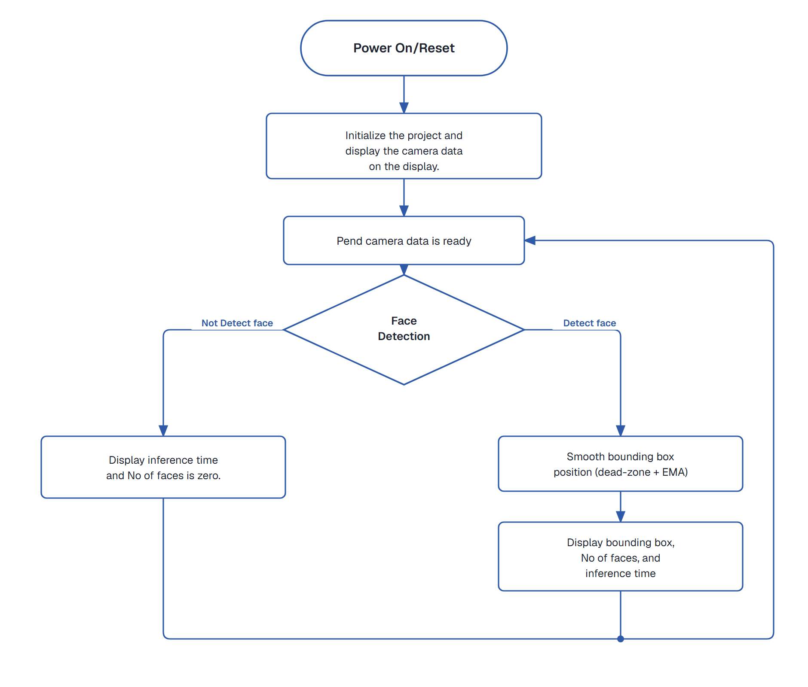
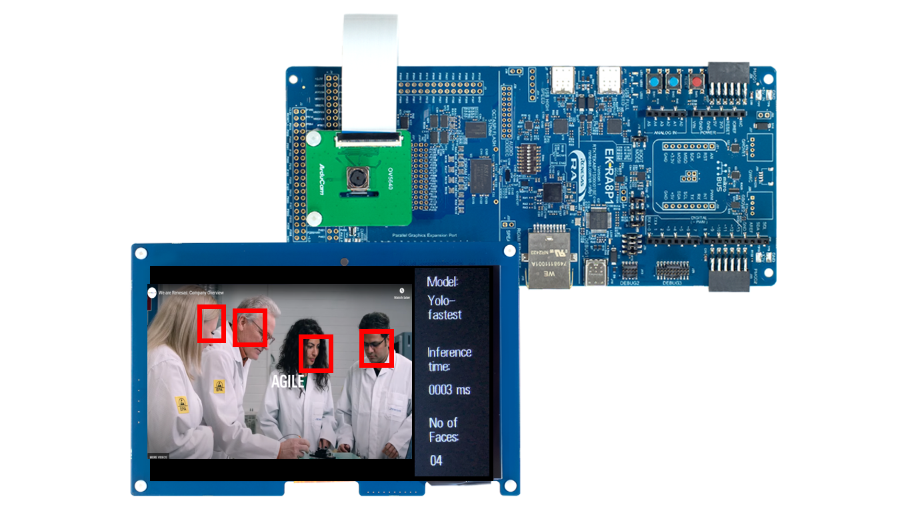

# Introduction

This demo project showcases real-time face detection on a Renesas RA8 microcontroller using the RUHMI Framework. A camera captures images, and a lightweight neural network (YOLO-fastest) detects faces in real time, accelerated by the on-chip Arm Ethos-U NPU. Results are displayed on an LCD with bounding boxes around detected faces.

Use the [.zip file](../ek_ra8p1_vision_face_detection_yolo_fastest_FSP660.zip) when you import the application project into e² studio.

---

## Overview
The system captures camera frames, detects faces, and draws bounding boxes over detected regions. The primary goal is to demonstrate efficient AI processing using the Ethos-U NPU on an embedded platform with real-time constraints.

| No | Content | Description |
| --- | --- | --- |
| 1 | AI Model | YOLO-fastest |
| 2 | Inference time | Displays inference time in milliseconds |
| 3 | Num of face | Count of detected faces |

<div align="center">
  
</div>

---

## Hardware Setup
- **Evaluation Kit**: Renesas **EK-RA8P1**
- **Camera & Display**: Integrated in the EK-RA8P1 kit
- **NPU**: On-board **Arm Ethos-U** (no external setup required)
- **Connection to PC**: Power on the EK-RA8P1 kit with any of the available USB connectors
- **Important**: Ensure the **SW4 switch (middle of the board)** is set to all **0** (OFF)

---

## Software Setup

- **e² studio version**: 2026-07
- **Flexible Software Package (FSP)**: 6.6.0
- **Toolchain**: LLVM/Clang (ATfE 22.1.0) is the toolchain this project is configured to build with by default.
- **RTOS**: FreeRTOS (via FSP's `rtos.awsfreertos` module)
- **mera framework**: Included in this repository

## How to Compile and Flash

1. **Install e² studio**
2. **Connect your EK-RA8P1 board** via USB Type-C
3. **Download this repository and extract**, or extract the project zip linked above
4. **Open e² studio** and import the project: `File` → `Import` → `Existing Projects into Workspace`
5. **Generate drivers**: double-click `configuration.xml` → `Generate Project Content`
6. **Build the project**: right-click the project in the left sidebar → `Build Project`
7. **Flash to the board**: right-click the project → `Debug As` → `Renesas GDB Hardware Debugging`
8. **Run**: click `Resume` a few times

---
## Key Source Code

Main AI inference logic is in:  
`src/ai_application/face_detection/MainLoop_obj.cc` (`main_loop_face_detection()`)

Detection result update/smoothing is in:  
`src/ai_inference_thread_entry.c` (`update_detection_result()`)

Display/UI rendering is in:  
`src/display_layer/face_detection_screen_mipi.c`

---
## Code Explanation

```cpp
memcpy(mera_input_ptr(), model_buffer_int8, IMAGE_DATA_SIZE);
```
Copies the preprocessed input image into the model input buffer.

```cpp
volatile uint32_t old_counter = TimeCounter_CurrentCountGet();
mera_invoke();
application_processing_time.ai_inference_time_ms = TimeCounter_CountValueConvertToMs(old_counter, TimeCounter_CurrentCountGet());
```
Runs one inference and measures the inference time in milliseconds.

```cpp
int8_t* output0 = (int8_t*)mera_output1_ptr();
int8_t* output1 = (int8_t*)mera_output2_ptr();
```
Gets pointers to the two model output tensors used by post-processing.

---

## Results & Performance

| Mode | Inference Time | Notes |
| --- | --- | --- |
| Ethos-U enabled | ~4ms | NPU-accelerated inference |

## Model reference
The model used in this project is YOLO-fastest-192, downloadable from [here](https://github.com/emza-vs/ModelZoo/tree/master/object_detection).
