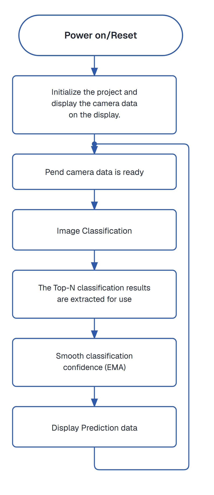
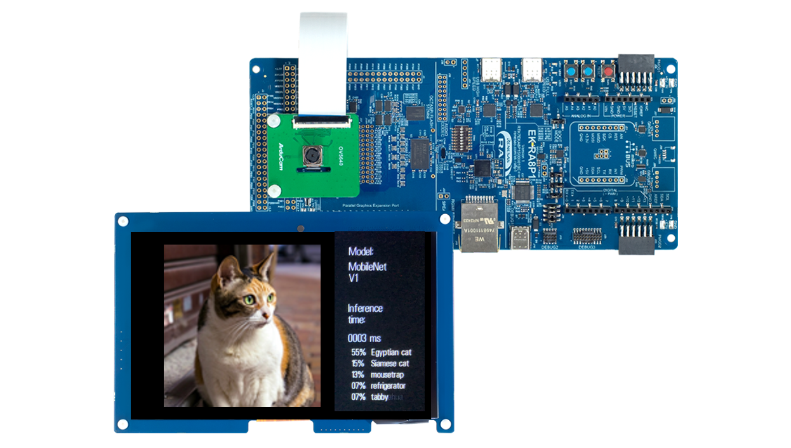

# Introduction

This demo showcases an image classification application using MobileNet V1 on the Renesas EK-RA8P1 board with Arm Ethos-U NPU support. It leverages the RUHMI Framework for efficient model deployment. Real-time inference is performed on camera input, and the Top-5 classification results are displayed on an LCD, demonstrating low-power, high-performance edge AI on an embedded platform.

Use the [.zip file](../ek_ra8p1_vision_image_classification_mobilenet_v1_FSP660.zip) when you import the application project into e² studio.

---

## Overview

This demo performs real-time image classification on captured camera frames, using a MobileNet V1 model trained on the ImageNet dataset (1000 classes). The Top-5 predicted classes, with their confidence scores, are displayed on the screen.

| No | Content | Description |
| --- | --- | --- |
| 1 | AI Model | MobileNet V1 |
| 2 | Inference time | Displays inference time in milliseconds |
| 3 | Top-5 accuracy | The Top-5 predicted class labels along with their confidence scores |

<div align="center">
  
</div>

---

## Hardware Setup

- **Evaluation Kit**: Renesas **EK-RA8P1**
- **Camera & Display**: Integrated in the EK-RA8P1 kit
- **NPU**: On-board **Arm Ethos-U** (no external setup required)
- **Connection to PC**: Power on the EK-RA8P1 kit with any of the available USB connectors
- **Important**: Ensure the **SW4 switch (middle of the board)** is set to all **0** (OFF)

---

## Software Setup

- **e² studio version**: 2026-07
- **Flexible Software Package (FSP)**: 6.6.0
- **Toolchain**: LLVM/Clang (ATfE 22.1.0) is the toolchain this project is configured to build with by default.
- **RTOS**: FreeRTOS (via FSP's `rtos.awsfreertos` module)
- **mera inference framework**: Included in this repository
- **Model**: MobileNet V1, quantized INT8, 1000-class ImageNet output

No external dependencies are needed beyond what's bundled in this repository and FSP.

## How to Compile and Flash

1. **Install e² studio**
2. **Connect your EK-RA8P1 board** via USB Type-C
3. **Download this repository and extract**, or extract the project zip linked above
4. **Open e² studio** and import the project: `File` → `Import` → `Existing Projects into Workspace`
5. **Generate drivers**: double-click `configuration.xml` → `Generate Project Content`
6. **Build the project**: right-click the project in the left sidebar → `Build Project`
7. **Flash to the board**: right-click the project → `Debug As` → `Renesas GDB Hardware Debugging`
8. **Run**: click `Resume` a few times

---
## Key Source Code

Main AI inference logic is in:  
`src/ai_application/image_classification/MainLoop_img.cc` (`main_loop_image_classification()`)

Classification result smoothing is in:  
`src/ai_inference_thread_entry.c` (`update_classification_result()`)

Display/UI rendering is in:  
`src/display_layer/image_classification_screen_mipi.c` (`do_image_classification_screen()`)

---
## Code Explanation

```cpp
copy_data_to_mera((int8_t*)mera_input_ptr(), (uint8_t*)model_buffer_int8, (uint32_t)mera_input_size());
```
Copies the preprocessed input image into the model input buffer.

```cpp
volatile uint32_t old_counter = TimeCounter_CurrentCountGet();
mera_invoke();
application_processing_time.ai_inference_time_ms = TimeCounter_CountValueConvertToMs(old_counter, TimeCounter_CurrentCountGet());
```
Runs one inference and measures the inference time in milliseconds.

```cpp
int8_t* output = (int8_t*)mera_output_ptr();
```
Gets a pointer to the model output tensor used by post-processing.

---

## Results & Performance

| Mode | Inference Time | Notes |
| --- | --- | --- |
| Ethos-U enabled | ~2ms | NPU-accelerated inference |

## Model reference

The model used in this project is MobileNet V1, quantized to INT8 with a 1000-class (ImageNet) output, referenced from [tensorflow/models](https://github.com/tensorflow/models/blob/master/research/slim/nets/mobilenet_v1.md).
