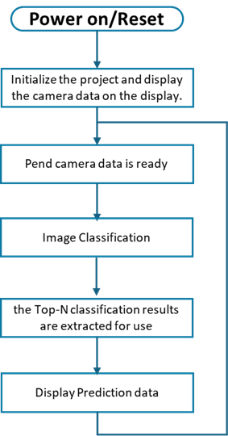
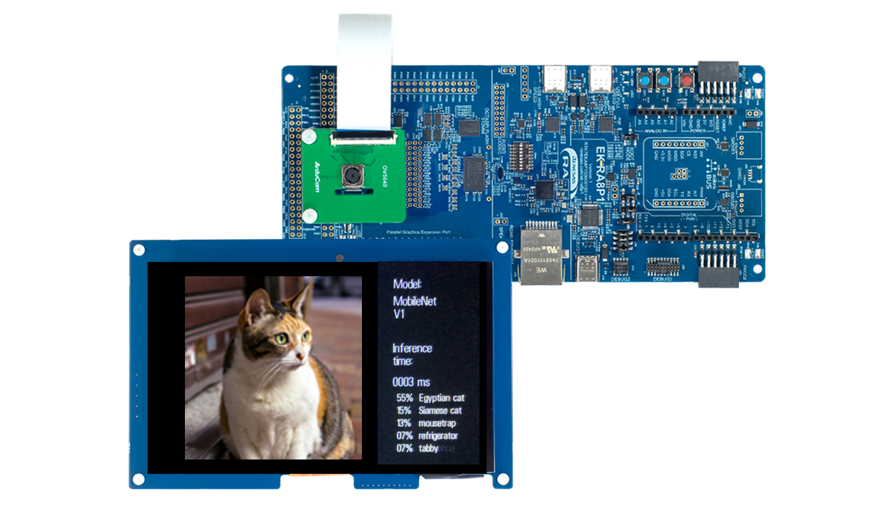

# Introduction


This demo showcases an image classification application using MobileNet_v1 on the Renesas RA8P1 MCU with Arm Ethos-U55 support. It leverages the RUHMI Framework for efficient model deployment. Real-time inference is performed on camera input, and the top-5 classification results are displayed on an LCD, demonstrating low-power, high-performance edge AI capabilities. 

---

## Overview

This demo performs real-time image classification on captured frames, using a MobileNet V1 model trained on the ImageNet dataset (1000 classes). The top-5 predicted classes with associated probabilities are displayed on the screen.

| No   | Content            | Description      |
| ---- | --------------- | --------- |
|1|AI Model|mobilenetv1|
|2|Inference time|Displays inference time in milliseconds|
|3|TOP 5 accuracy|The Top-5 predicted class labels along with their confidence scores on the screen|

<div align="center">
    


<div align="left">
  
---

## Hardware Setup

- **Board**: Renesas EK-RA8P1
- **Camera & Display**: Integrated into the EK-RA8P1 kit
- **NPU**: On-chip **Arm Ethos-U** (no external setup required)
- **Connection to PC**: Power on the EK-RA8P1 Kit with any of the USB connectors that are available.  
- **Switch Setting**: Ensure **SW4** (center switch block) is set to all **0** (OFF)  
  > (See right image above for reference)

---

## Software Setup

- **IDE**: e² studio **2025-04.1**
- **Flexible Software Package (FSP)**: **6.0.0** (default installed)
- **mera inference framework**: Included in this repository
- **Model**: MobileNet V1 (quantized, 1000-class output)

No external dependencies are needed beyond what’s bundled in this repo and FSP.

---

## How to Compile and Flash

1. **Install e² studio 2025-04.1**
2. **Connect your EK-RA8P1 board** via USB Type-C
3. **Download this repository and extract**
3. **Open e² studio** and import this project: `File` -> `Import` -> `Existing Projects into Workspace`
4. **Generate drivers**: Double click `configuration.xml` -> `Generate Project Content`
5. **Build the Project**:
    - `Right click the project name in left side bar` -> `Build Project`
6. **Flash to Board**:
    - `Right click the project name in left side bar` -> `Debug As` -> `Renesas GDB Hardware Debugging`.
7. **Run the binary**
    - Click `Resume` button several times
---
## Key Source Code

Main AI inference logic is in:
`<project_root/src/ai_application/image_classification/MainLoop_img.cc> (from line 99)
`

### Code Explanation:

```cpp
copy_data_to_mera((int8_t*)mera_input_ptr(), (uint8_t*)model_buffer_int8, (uint32_t)mera_input_size());
```
* Prepares the input data for inference by copying it into the memory area expected by the mera framework.

```cpp
volatile uint32_t old_counter = TimeCounter_CurrentCountGet();
mera_invoke();
volatile uint32_t new_counter = TimeCounter_CurrentCountGet();
```
* Measures inference time using a timer.
* `mera_invoke()` is the actual function that performs inference using Ethos-U (if enabled).

```cpp
volatile uint32_t diff = new_counter - old_counter;
application_processing_time.ai_inference_time_ms = TimeCounter_CountValueConvertToMs(old_counter, new_counter);
```
* Calculates the AI processing time in milliseconds and stores it in a global variable.

```cpp
int8_t* output = (int8_t*)mera_output1_ptr();
```
Retrieves the pointer to the output buffer, it contain the model's results for postprocessing. Postprocessing ranks the top-5 class predictions using softmax and displays results.

### Results Display
The demo displays:
* Top-5 predicted classes
* Class names (mapped from ImageNet labels)
* Confidence probabilities (approximate, using softmax from int8 scores)


## Results & Performance

| Mode             | Inference Time |            Notes              |
|------------------|----------------|-------------------------------|
| Ethos-U enabled  |      2ms       | NPU accelerated inference     |
| Ethos-U disabled |      50ms      | Software fallback only        |


## Model reference

You can generate the model using the provided python script `generate_IC_model_tflite.py` and running it in the same enviroment as the compiler `python3 -m venv mera-env`, refer to `venv` installation [here](../../install/README.md).  
The model is referenced from the following [Github](https://github.com/tensorflow/models/blob/master/research/slim/nets/mobilenet_v1.md) .


