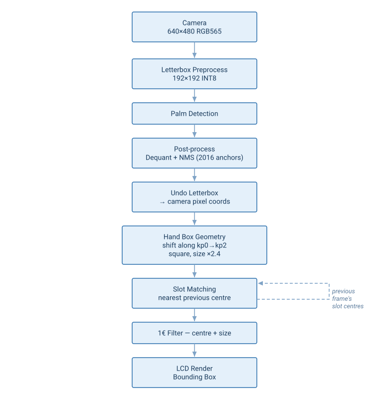
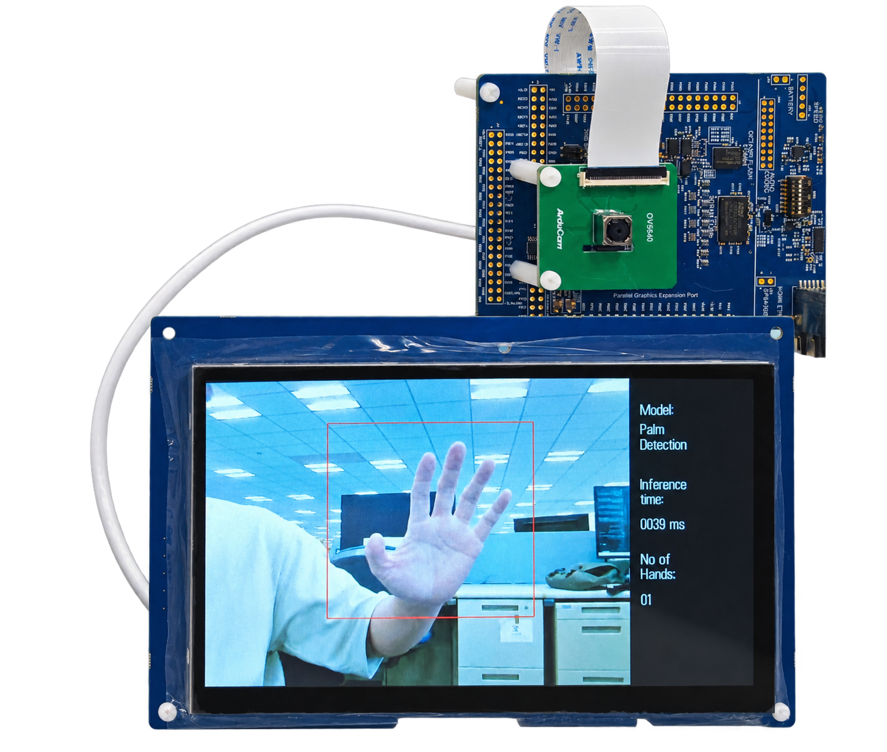

# Introduction
This demo project runs real-time palm detection on a Renesas RA8P1 MCU using the RUHMI Framework AI MCU Compiler. A single INT8 model locates palms in the camera frame every frame, and results are displayed on an LCD as bounding boxes. Up to 8 palms are detected simultaneously.

Use the [.zip file](../ek_ra8p1_vision_palm_detection_model_camera_LCD_FSP660.zip) when you import the application project into e² studio.

---

## Overview
The pipeline captures a frame, runs palm detection, and renders the detection boxes on screen.

| No | Content | Description |
|----|---------|-------------|
| 1 | AI Model | Palm Detection INT8 (192×192) |
| 2 | Max Palms | 8 |
| 3 | Model outputs | score, box (center + size), 2 keypoints per detection |
| 4 | AI inference time | ~39ms |
| 5 | Camera frame period | 26ms (38 fps), fixed |

## Architectural Diagram

<div align="center">

</div>

---

## Hardware Setup
- **Evaluation Kit**: Renesas **EK-RA8P1**
- **Camera & Display**: Integrated in the EK-RA8P1 kit
- **NPU**: On-board **Arm Ethos-U55** (no external setup required)
- **Connection to PC**: Power on the EK-RA8P1 kit with any of the available USB connectors
- **Important**: Ensure the **SW4 switch (middle of the board)** is set to all **0** (OFF)

## Software Setup

- **e² studio version**: 2026-07
- **Flexible Software Package (FSP)**: 6.6.0
- **Toolchain**: LLVM/Clang (ATfE 22.1.0) is the toolchain this project is configured to build with by default.
- **RTOS**: FreeRTOS (via FSP's `rtos.awsfreertos` module)
- **RUHMI AI MCU Compiler**: Included in this repository

## How to Compile and Flash

1. **Install e² studio**
2. **Connect your EK-RA8P1 board** via USB Type-C
3. **Download this repository and extract**, or extract the project zip linked above
4. **Open e² studio** and import the project: `File` → `Import` → `Existing Projects into Workspace`
5. **Generate drivers**: double-click `configuration.xml` → `Generate Project Content`
6. **Build the project**: right-click the project in the left sidebar → `Build Project`
7. **Flash to the board**: right-click the project → `Debug As` → `Renesas GDB Hardware Debugging`
8. **Run**: click `Resume` a few times

> **Note:** In Release builds, the demo may require one manual board reset after flashing (or power-cycle) before it runs correctly.

---
## Key Source Code

Main AI inference logic is in:  
`src/ai_application/palm_detection/MainLoop_obj.cc` (`main_loop_palm_detection()`)

Detection result update/publish is in:  
`src/ai_inference_thread_entry.c` (`update_detection_result()`)

Display/UI rendering is in:  
`src/display_layer/detection_screen_mipi.c` (`do_detection_screen()`)

---
## Code Explanation

```cpp
memcpy((void*)mera_input_ptr(), (const void*)model_buffer_int8, IMAGE_DATA_SIZE);
SCB_CleanDCache_by_Addr((uint32_t*)mera_input_ptr(), (int32_t)IMAGE_DATA_SIZE);
```
Copies the preprocessed input image into the model input buffer and cleans D-cache before NPU inference.

```cpp
volatile uint32_t old_counter = TimeCounter_CurrentCountGet();
mera_invoke();
application_processing_time.ai_inference_time_ms = TimeCounter_CountValueConvertToMs(old_counter, TimeCounter_CurrentCountGet());
```
Runs one inference and measures the inference time in milliseconds.

```cpp
int8_t* out_scores = mera_output_scores_ptr();
int8_t* out_boxes  = mera_output_boxes_ptr();
int8_t* out_kp0    = mera_output_kp0_ptr();
int8_t* out_kp2    = mera_output_kp2_ptr();
```
Gets pointers to the model output tensors used by palm post-processing.

---

## Results & Performance

| Metric | Typical Value | Notes |
|--------|---------------|-------|
| Total pipeline time | ~38ms per frame | Measured on Palm Detection Only demo |
| AI pipeline total | ~38ms | Measured `ai_inference_time_ms` |

> **Note:** `ai_inference_time_ms` measures the AI thread pipeline window: palm tensor copy + palm inference + palm post-processing. It does not include camera capture period, camera post-processing, or LCD refresh time.

## Example output

<div align="center">

</div>

## Model Reference

The palm detection model is based on [hand-gesture-recognition-using-onnx](https://github.com/PINTO0309/hand-gesture-recognition-using-onnx) by PINTO0309 (Apache-2.0), originally derived from MediaPipe by Google LLC.

The model has been optimized and quantized (INT8) by Renesas to run efficiently on the EK-RA8P1 Ethos-U55 NPU.

> **Note:** This example is provided as a demo. The model has not been retrained or fine-tuned for improved accuracy and is provided as-is.
