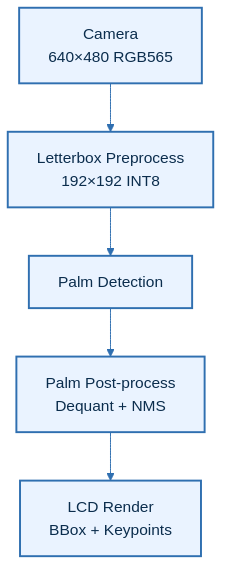
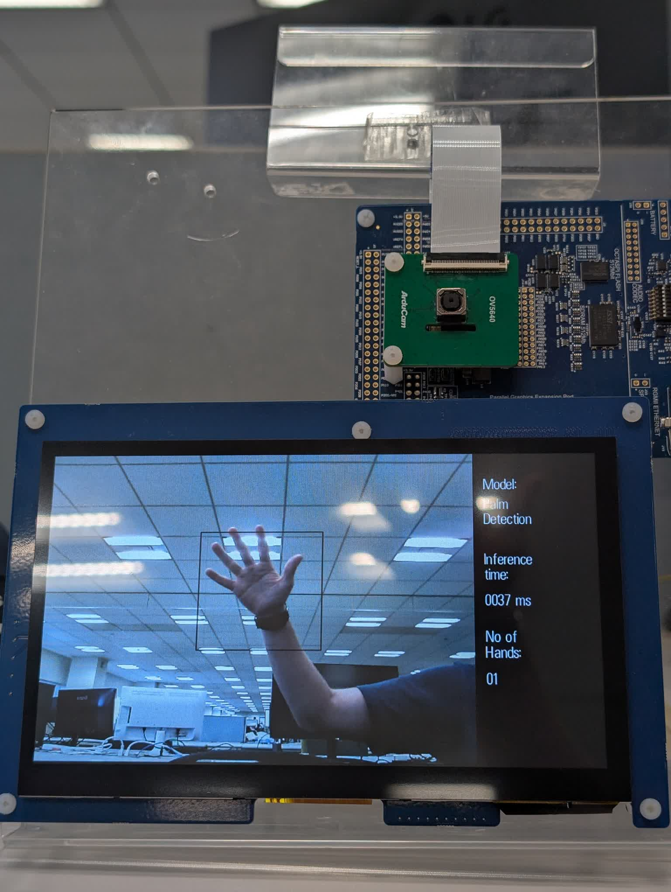

# Introduction
This demo project showcases palm detection on Renesas RA8P1 MCU using the RUHMI AI MCU Compiler. A camera captures images, and a lightweight neural network detects palms in real time. Results are displayed on an LCD with bounding boxes and keypoints. The project demonstrates efficient AI inference on embedded systems with up to 8 simultaneous palm detections.

Use [.zip file](../ek_ra8p1_vision_palm_detection_model_camera_LCD_FSP640.zip) when you inport the application project into e2studio.

## Overview
The system captures camera frames, detects palms using an INT8 quantized model, and draws bounding boxes with palm keypoints over detected regions. Post-processing includes anchor-based decoding and Non-Maximum Suppression (NMS).

| No | Content | Description |
|----|---------|-------------|
| 1 | AI Model | Palm Detection Full (MediaPipe-based, INT8) |
| 2 | Input Resolution | 192×192 RGB |
| 3 | Max Detections | less than 8 palms |
| 4 | Total pipeline time | ~38ms per frame (measured) |

## Architectural Diagram

## [Hardware Setup](https://github.com/renesas/ruhmi-framework-mcu/tree/main/application_examples)
- **Evaluation Kit**: Renesas **EK-RA8P1**
- **Camera & Display**: Integrated in the EK-RA8P1 kit
- **NPU**: On-board **Arm Ethos-U55** (no external setup required)
- **Connection to PC**: Power on the EK-RA8P1 Kit with any of the USB connectors that are available.
- **Important**: Ensure the **SW4 switch (middle of the board)** is set to all **0** (OFF)

## Software Setup

- **e² studio version**: 2025-12 (25.12.0)
- **Flexible Software Package (FSP)**: 6.4.0
- **RUHMI AI MCU Compiler**: Included in this repository

## How to Compile and Flash

1. **Install e² studio**
2. **Connect your EK-RA8P1 board** via USB Type-C
3. **Download this repository and extract**
4. **Open e² studio** and import this project: `File` -> `Import` -> `Existing Projects into Workspace`
5. **Generate drivers**: Double click `configuration.xml` -> `Generate Project Content`
6. **Build the Project**:
    - `Right click the project name in left side bar` -> `Build Project`
7. **Flash to Board**:
    - `Right click the project name in left side bar` -> `Debug As` -> `Renesas GDB Hardware Debugging`.
8. **Run the binary**
    - Click `Resume` button several times

> **Note:** In Release builds, the demo may require one manual board reset after flashing (or power-cycle) before it runs correctly.

## Results & Performance

| Metric | Typical Value | Notes |
|--------|---------------|-------|
| Total pipeline time | ~38ms per frame | Measured on Palm Detection Only demo |
| AI pipeline total | ~38ms | Measured `ai_inference_time_ms` |

> **Note:** `ai_inference_time_ms` measures the AI thread pipeline window: palm tensor copy + palm inference + palm post-processing. It does **not** include camera capture period, camera post-processing, or LCD refresh time.

## Example output

## Model Reference
Model is based on the palm detection model from [hand-gesture-recognition-using-onnx](https://github.com/PINTO0309/hand-gesture-recognition-using-onnx) by PINTO0309 (Apache-2.0), originally derived from MediaPipe HandLandMark by Google LLC.

The model has been optimized and quantized (INT8) by Renesas to run efficiently on the EK-RA8P1 Ethos-U55 NPU. It is not the original model as-is.

> Note: This example is provided as a demo. The model has not been retrained or fine-tuned for improved accuracy and is provided as-is.
