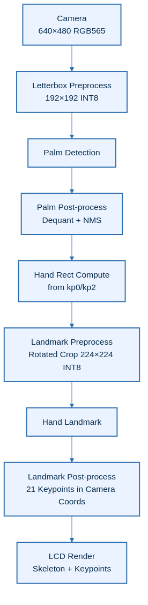

# Introduction
This demo project showcases a two-stage hand tracking pipeline on a Renesas RA8P1 MCU using the RUHMI Framework AI MCU Compiler. First, a palm detection model locates hands in the camera frame. Then, a hand landmark model extracts 21 keypoints per detected hand with coordinates `(x, y, z)`, where `z` is a relative depth value. Results are displayed on an LCD with bounding boxes and a hand skeleton overlay. Up to 2 hands are tracked simultaneously.

Use [.zip file](../ek_ra8p1_vision_palm_detection_hand_landmarkmodel_camera_LCD_FSP640.zip) when you inport the application project into e2studio.

## Overview
The system runs a sequential pipeline: palm detection finds hands, computes a rotated crop region from palm keypoints, and feeds it to the hand landmark model for detailed keypoint extraction.

| No | Content | Description |
|----|---------|-------------|
| 1 | AI Models | Palm Detection INT8 (192×192) + Hand Landmark INT8 (224×224) |
| 2 | Max Hands | 2 |
| 3 | Keypoints | 21 per hand (x, y + relative z depth) |
| 4 | AI pipeline time | ~63ms (single hand, measured) |

## Architectural Diagram

---

## [Hardware Setup](https://github.com/renesas/ruhmi-framework-mcu/tree/main/application_examples)
- **Evaluation Kit**: Renesas **EK-RA8P1**
- **Camera & Display**: Integrated in the EK-RA8P1 kit
- **NPU**: On-board **Arm Ethos-U55** (no external setup required)
- **Connection to PC**: Power on the EK-RA8P1 Kit with any of the USB connectors that are available.
- **Important**: Ensure the **SW4 switch (middle of the board)** is set to all **0** (OFF)

## Software Setup

- **e² studio version**: 2025-12 (25.12.0)
- **Flexible Software Package (FSP)**: 6.4.0
- **RUHMI AI MCU Compiler**: Included in this repository

## How to Compile and Flash

1. **Install e² studio**
2. **Connect your EK-RA8P1 board** via USB Type-C
3. **Download this repository and extract**
4. **Open e² studio** and import this project: `File` -> `Import` -> `Existing Projects into Workspace`
5. **Generate drivers**: Double click `configuration.xml` -> `Generate Project Content`
6. **Build the Project**:
    - `Right click the project name in left side bar` -> `Build Project`
7. **Flash to Board**:
    - `Right click the project name in left side bar` -> `Debug As` -> `Renesas GDB Hardware Debugging`.
8. **Run the binary**
    - Click `Resume` button several times

> **Note:** In Release builds, the demo may require one manual board reset after flashing (or power-cycle) before it runs correctly.

## Results & Performance

| Metric | Typical Value | Notes |
|--------|---------------|-------|
| AI pipeline total (0 hands) | ~38ms | Measured `ai_inference_time_ms` |
| AI pipeline total (1 hand) | ~63ms | Measured `ai_inference_time_ms` |
| AI pipeline total (2 hands) | ~84ms | Measured `ai_inference_time_ms` |

> **Note:** `ai_inference_time_ms` measures the AI thread pipeline window: palm tensor copy + palm inference + palm post-processing + per-hand landmark preprocess/inference/post-process. It does **not** include camera capture period, camera post-processing, or LCD refresh time. This project supports up to 2 palms; one-hand performance is typically in the low-60ms range, and two-hand performance is around 84ms.

## Model Reference
Models are based on [hand-gesture-recognition-using-onnx](https://github.com/PINTO0309/hand-gesture-recognition-using-onnx) by PINTO0309 (Apache-2.0), originally derived from MediaPipe by Google LLC.

- **Palm Detection**: MediaPipe Palm Detection Full
- **Hand Landmark**: MediaPipe Hand Landmark Sparse

Both models have been optimized and quantized (INT8) by Renesas to run efficiently on the EK-RA8P1 Ethos-U55 NPU. They are not the original models as-is.

> Note: This example is provided as a demo. The model has not been retrained or fine-tuned for improved accuracy and is provided as-is.
