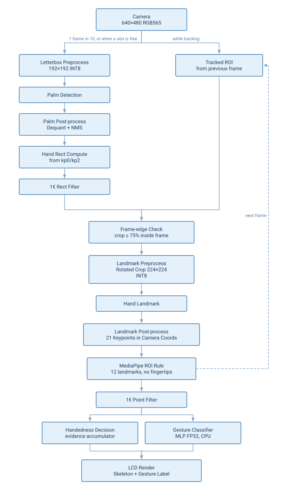
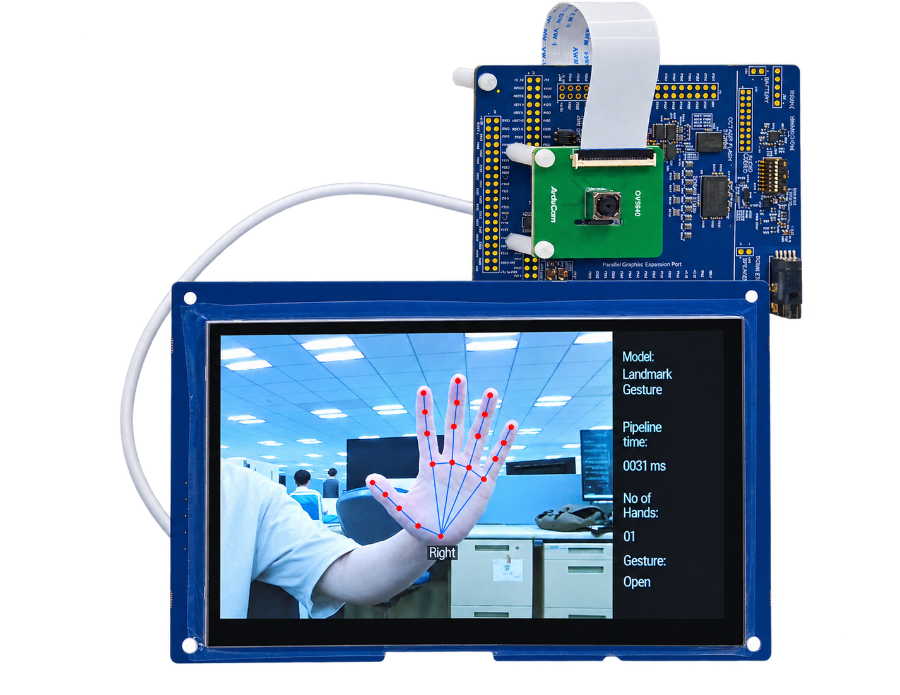

# Introduction
This demo project showcases a complete hand gesture recognition pipeline on a Renesas RA8P1 MCU using the RUHMI Framework AI MCU Compiler. It combines palm detection, hand landmark extraction, and an MLP-based gesture classifier to recognize hand gestures in real time. The system supports up to 2 hands and displays gesture labels with a hand skeleton overlay on an LCD.

Use the [.zip file](../ek_ra8p1_vision_palm_detection_hand_landmarkmodel_gesture_recognition_camera_LCD_FSP660.zip) when you import the application project into e² studio.

---

## Overview
The system runs a three-stage pipeline: palm detection finds hands, the landmark model extracts 21 keypoints, and a lightweight classifier predicts gestures from normalized keypoints. While a hand is tracked, the ROI is re-derived from landmarks, so palm detection runs periodically instead of every frame.

| No | Content | Description |
|----|---------|-------------|
| 1 | AI Models | Palm Detection INT8 + Hand Landmark INT8 + Keypoint Classifier FP32 |
| 2 | Max Hands | 2 |
| 3 | Gestures | Open, Close, Pointer |
| 4 | AI pipeline time | ~30ms (single hand, measured) |
| 5 | Camera frame period | 26ms (38 fps), fixed |

## Architectural Diagram

<div align="center">

</div>

---

## Hardware Setup
- **Evaluation Kit**: Renesas **EK-RA8P1**
- **Camera & Display**: Integrated in the EK-RA8P1 kit
- **NPU**: On-board **Arm Ethos-U55** (no external setup required)
- **Connection to PC**: Power on the EK-RA8P1 kit with any of the available USB connectors
- **Important**: Ensure the **SW4 switch (middle of the board)** is set to all **0** (OFF)

## Software Setup

- **e² studio version**: 2026-07
- **Flexible Software Package (FSP)**: 6.6.0
- **Toolchain**: LLVM/Clang (ATfE 22.1.0) is the toolchain this project is configured to build with by default.
- **RTOS**: FreeRTOS (via FSP's `rtos.awsfreertos` module)
- **RUHMI AI MCU Compiler**: Included in this repository

## How to Compile and Flash

1. **Install e² studio**
2. **Connect your EK-RA8P1 board** via USB Type-C
3. **Download this repository and extract**, or extract the project zip linked above
4. **Open e² studio** and import the project: `File` → `Import` → `Existing Projects into Workspace`
5. **Generate drivers**: double-click `configuration.xml` → `Generate Project Content`
6. **Build the project**: right-click the project in the left sidebar → `Build Project`
7. **Flash to the board**: right-click the project → `Debug As` → `Renesas GDB Hardware Debugging`
8. **Run**: click `Resume` a few times

> **Note:** In Release builds, the demo may require one manual board reset after flashing (or power-cycle) before it runs correctly.

## Board Controls

| Control | Action |
|---------|--------|
| **SW2** | Pause / resume the whole recognition pipeline |

---
## Key Source Code

Main AI pipeline logic is in:  
`src/ai_application/palm_detection/MainLoop_obj.cc` (`main_loop_palm_detection()`)

Detection/landmark shared result update is in:  
`src/ai_inference_thread_entry.c` (`update_detection_result()`, `update_landmark_result()`)

Gesture classification is in:  
`src/ai_application/palm_detection/gesture_classify.c` (`gesture_classify()`)

Display/UI rendering is in:  
`src/display_layer/detection_screen_mipi.c` (`do_detection_screen()`)

---
## Code Explanation

```cpp
memcpy((void*)mera_input_ptr(), (const void*)model_buffer_int8, IMAGE_DATA_SIZE);
SCB_CleanDCache_by_Addr((uint32_t*)mera_input_ptr(), (int32_t)IMAGE_DATA_SIZE);
mera_invoke();
```
Copies palm-detector input into the tensor buffer, cleans D-cache, and runs NPU inference.

```cpp
int8_t* out_scores = mera_output_scores_ptr();
int8_t* out_boxes  = mera_output_boxes_ptr();
int8_t* out_kp0    = mera_output_kp0_ptr();
int8_t* out_kp2    = mera_output_kp2_ptr();
```
Gets palm model output tensors for post-processing.

```cpp
update_handedness(i);
update_gesture(i);
draw_landmark_points(i);
```
Updates handedness/gesture once per inference result and draws landmark overlays.

---

## Results & Performance

| Stage | Time (ms) | Notes |
|-------|-----------|-------|
| Camera frame period | ~26 | Fixed |
| LCD refresh period | ~28 | Measured `lcd_display_update_refresh_ms` |
| AI pipeline total (0 hands) | ~38 | Detector runs every frame while nothing is tracked |
| AI pipeline total (1 hand) | ~30 | Measured `ai_inference_time_ms` |
| AI pipeline total (2 hands) | ~53 | Two landmark inferences; detector idle while both slots track |
| Gesture classification (CPU) | <0.1 | Included in AI pipeline time |


> **Note:** `ai_inference_time_ms` measures the AI thread pipeline window: palm tensor copy + palm inference + palm post-processing + per-hand landmark preprocess/inference/post-process (and classifier call overhead, which is negligible). It does **not** include camera capture period, camera post-processing, or LCD refresh time.


## Gesture Classes

| Gesture | Description |
|---------|-------------|
| Open | All fingers extended |
| Close | Fist / all fingers closed |
| Pointer | Index finger extended, others closed |

## Example output

<div align="center">

</div>

## Model Reference

Models are based on [hand-gesture-recognition-using-onnx](https://github.com/PINTO0309/hand-gesture-recognition-using-onnx) by Kazuhito Takahashi / PINTO0309 (Apache-2.0), originally derived from MediaPipe by Google LLC.

- **Palm Detection**: MediaPipe Palm Detection Full
- **Hand Landmark**: MediaPipe Hand Landmark Sparse
- **Keypoint Classifier**: MLP gesture classifier (Open/Close/Pointer)

The palm detection and hand landmark models have been optimized and quantized (INT8) by Renesas to run efficiently on the EK-RA8P1 Ethos-U55 NPU.

> Note: This example is provided as a demo. The model has not been retrained or fine-tuned for improved accuracy and is provided as-is.