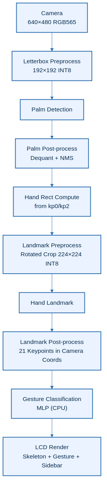
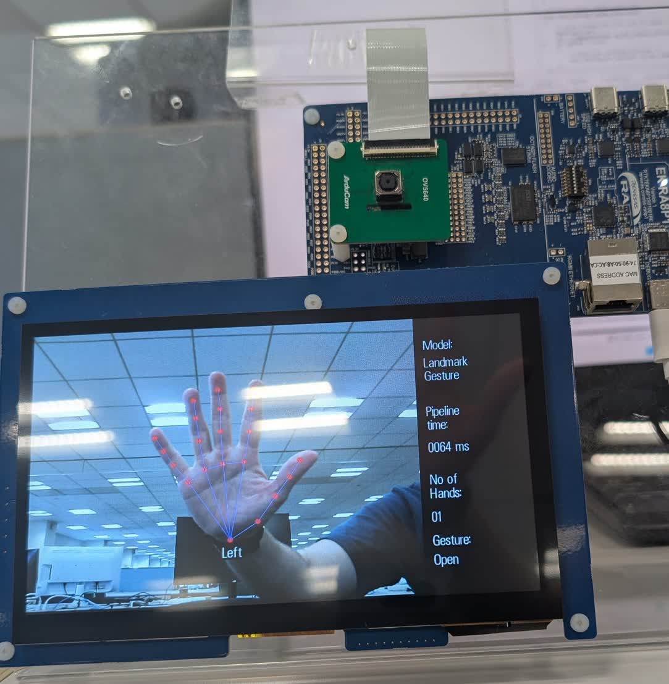

# Introduction
This demo project showcases a complete hand gesture recognition pipeline on a Renesas RA8P1 MCU using the RUHMI Framework AI MCU Compiler. It combines palm detection, hand landmark extraction, and an MLP-based gesture classifier to recognize hand gestures in real time. The system supports up to 2 hands and displays the detected gesture (Open, Close, Pointer) alongside the hand skeleton on an LCD.

Use [.zip file](../ek_ra8p1_vision_palm_detection_hand_landmarkmodel_gesture_recognition_camera_LCD_FSP640.zip) when you inport the application project into e2studio.

## Overview
The system runs a three-stage pipeline: palm detection locates the hand, hand landmark extracts 21 keypoints with `(x, y, z)` coordinates (where `z` is relative depth), and a lightweight MLP classifier identifies the gesture from normalized keypoint coordinates.

| No | Content | Description |
|----|---------|-------------|
| 1 | AI Models | Palm Detection INT8 + Hand Landmark INT8 + Keypoint Classifier FP32 |
| 2 | Max Hands | 2 |
| 3 | Gestures | Open, Close, Pointer |
| 4 | AI pipeline time | ~63ms (single hand, measured) |

## Architectural Diagram

---

## [Hardware Setup](https://github.com/renesas/ruhmi-framework-mcu/tree/main/application_examples)
- **Evaluation Kit**: Renesas **EK-RA8P1**
- **Camera & Display**: Integrated in the EK-RA8P1 kit
- **NPU**: On-board **Arm Ethos-U55** (no external setup required)
- **Connection to PC**: Power on the EK-RA8P1 Kit with any of the USB connectors that are available.
- **Important**: Ensure the **SW4 switch (middle of the board)** is set to all **0** (OFF)

## Software Setup

- **e² studio version**: 2025-12 (25.12.0)
- **Flexible Software Package (FSP)**: 6.4.0
- **RUHMI AI MCU Compiler**: Included in this repository

## How to Compile and Flash

1. **Install e² studio**
2. **Connect your EK-RA8P1 board** via USB Type-C
3. **Download this repository and extract**
4. **Open e² studio** and import this project: `File` -> `Import` -> `Existing Projects into Workspace`
5. **Generate drivers**: Double click `configuration.xml` -> `Generate Project Content`
6. **Build the Project**:
    - `Right click the project name in left side bar` -> `Build Project`
7. **Flash to Board**:
    - `Right click the project name in left side bar` -> `Debug As` -> `Renesas GDB Hardware Debugging`.
8. **Run the binary**
    - Click `Resume` button several times

> **Note:** In Release builds, the demo may require one manual board reset after flashing (or power-cycle) before it runs correctly.

## Results & Performance

| Stage | Time (ms) | Notes |
|-------|-----------|-------|
| LCD refresh period | ~28 | Measured `lcd_display_update_refresh_ms` |
| AI pipeline total (0 hands) | ~38 | Measured `ai_inference_time_ms` |
| AI pipeline total (1 hand) | ~63 | Measured `ai_inference_time_ms` |
| AI pipeline total (2 hands) | ~84 | Measured `ai_inference_time_ms` |
| Gesture classification (CPU) | <0.1 | Included in AI pipeline time; negligible cost |

> **Note:** `ai_inference_time_ms` measures the AI thread pipeline window: palm tensor copy + palm inference + palm post-processing + per-hand landmark preprocess/inference/post-process (and classifier call overhead, which is negligible). It does **not** include camera capture period, camera post-processing, or LCD refresh time.

## Gesture Classes

| Gesture | Description |
|---------|-------------|
| Open | All fingers extended |
| Close | Fist / all fingers closed |
| Pointer | Index finger extended, others closed |

## Example output

## Model Reference
Models are based on [hand-gesture-recognition-using-onnx](https://github.com/PINTO0309/hand-gesture-recognition-using-onnx) by Kazuhito Takahashi / PINTO0309 (Apache-2.0), originally derived from MediaPipe by Google LLC.

- **Palm Detection**: MediaPipe Palm Detection Full
- **Hand Landmark**: MediaPipe Hand Landmark Sparse
- **Keypoint Classifier**: MLP gesture classifier (Open/Close/Pointer)

The palm detection and hand landmark models have been optimized and quantized (INT8) by Renesas to run efficiently on the EK-RA8P1 Ethos-U55 NPU. They are not the original models as-is.

> Note: This example is provided as a demo. The model has not been retrained or fine-tuned for improved accuracy and is provided as-is.
