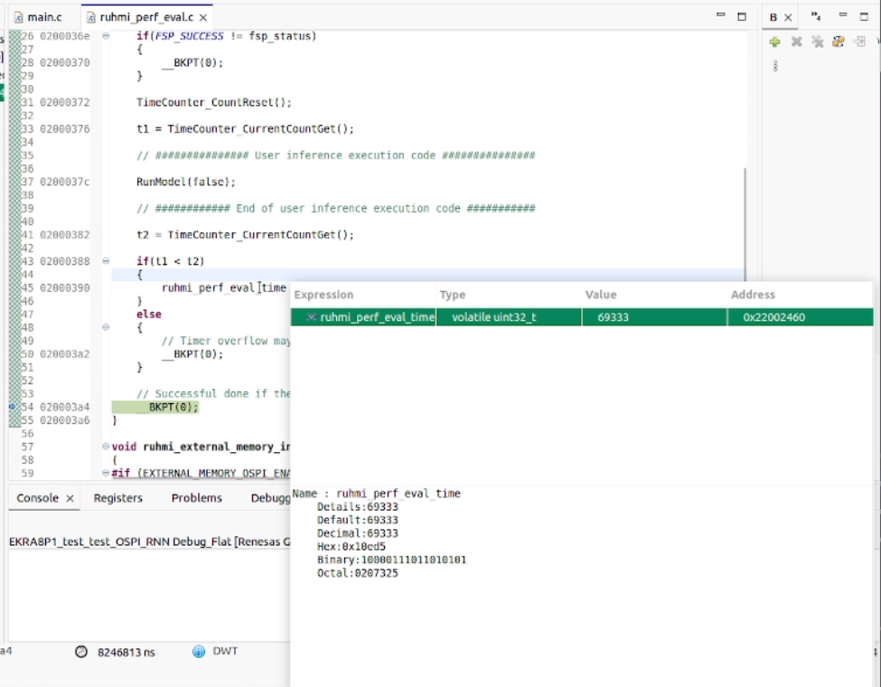

# RUHMI Performance Benchmark Base Project for EK-RA8P1

This guide helps developers quickly measure inference latency on EK-RA8P1 using the RUHMI AI compiler. [The base project](ruhmi_perf_exal_ek_ra8p1_base_project_fsp620.zip) is designed for easy integration of your own AI model C-code, with best practices for memory configuration and CPU/NPU execution.


## Overview

This guide enables:
- Quick benchmarking of inference speed on EK-RA8P1 with RUHMI AI compiler.
- Simple integration of RUHMI-generated C-code for your AI model.
- Guidance on memory choices (RAM/ROM/external) and CPU/NPU execution.

## Getting Started

**Prerequisites:**
- EK-RA8P1 board
- e2studio IDE v6.2.0
- LLVM compiler environment
- RUHMI AI compiler (for generating model code)

## Project Structure

```
ruhmi_perf_eval_ek_ra8p1
├─ .settings
│   └─ eventpointSettings
├─ src
│   ├─ hal_entry.c
│   ├─ hal_warmstart.c
│   └─ ruhmi_perf_eval
│       ├─ ruhmi_perf_eval.c  
│       ├─ ethosu_cache_maintenance.c
│       ├─ ruhmi_inference_code
│       └─ utils
├─ .api_xml
├─ .clangd
├─ .cproject
├─ .project
├─ .secure_azone
├─ .secure_rzone
├─ .secure_xml
├─ configuration.xml
├─ RA8P1_EK_Reset_OSPI.JLinkScript
├─ ra_cfg.txt
├─ ruhmi_perf_eval_ek_ra8p1 Debug_Flat.jlink
└─ ruhmi_perf_eval_ek_ra8p1 Debug_Flat.launch
```

- **ruhmi_inference_code**: Place your RUHMI-generated C source/header files here, those files are available after using the compiler in `<model>/MCU/compilation/src`.
- **utils**: Utility functions for external memory and timer initialization.
- **ethosu_cache_maintenance.c**: Enables the cache along with necessary maintenance codes.
- **ruhmi_perf_eval.c**: Source base code to add your runtime API and measure with timer.

## Importing the Base Project

1. **Launch e2studio IDE**
2. **Import the archive project**  
   `File > Import > Existing Projects into Workspace`  
   Select the provided `.zip` file.
3. **Open Smart Configurator**  
   Double-click `configuration.xml` and click `Generate Project Content`.

## Adding Your AI Model

### 1. Place RUHMI-Generated Code

- Copy your C source/header files into:  
  `src/ruhmi_perf_eval/ruhmi_inference_code`
- **Ignore**:  
  - `model_io_data.c/.h`
  - `hal_entry.c`
  - `sub_xxxx_io_data.c/.h`

### 2. Update Execution Code in `ruhmi_perf_eval.c`

#### CPU Only
Following the stucture provided in `computer_sub_0000.h` you should call in the I/O buffer and model weights.
```c
#include "ruhmi_inference_code/compute_sub_0000.h"
uint8_t main_storage[kBufferSize_sub_0000];
int8_t input[16384];
int8_t Identity_70183[2];

// Inference execution
compute_sub_0000(main_storage, input, Identity_70183);
```

#### CPU+NPU or NPU Only
For this case model.c file handles the complexities and wraps it nicely into `RunModel()` function.

```c
#include "ruhmi_inference_code/model.h"

// Inference execution
RunModel(false);
```

For more guidance to port the inference function into the source code, you can refer to [Guide to the generated C source code](../doc/runtime_api.md).

### 3. External Memory Initialization
The base project has this covered and provides you with #define function to easily leverage the various memories capabilities. 


- Call in `R_BSP_WarmStart()` after I/O port initialization:
  ```c
  ruhmi_external_memory_init();
  ```
- Enable macros in `ruhmi_perf_eval.c`, review the code to understand what they do:
  ```c
  #define EXTERNAL_MEMORY_OSPI_ENABLE (1)
  #define EXTERNAL_MEMORY_SDRAM_ENABLE (1)
  #define INTERNAL_MEMORY_SIP_ENABLE (0)
  ```
> **Note:** SIP is system in package and is not available function yet.

## Memory Configuration

### Leveraging `__attribute__` for Buffer Placement

RUHMI-generated code can be optimized for memory usage by placing large buffers (such as model weights) in external memory. This is crucial when FLASH overflows occur or when benchmarking large models.
Below table shows macro definition example for switching target memory (FSP v6.2.0).
| Buff type | Target memory type                         | Macro                                                              |
|-----------|--------------------------------------------|--------------------------------------------------------------------|
| ROM       | OnChipFlash                                | Nothing special. Just define like "const uint8_t buff[] = {xxxx};" |
| ROM       | OSPI (Unit 0, CS 1)                        | \_\_attribute\_\_((aligned(16), section(".ospi0_cs1")))            |
| ROM       | SiP Flash                                  | \_\_attribute\_\_((aligned(16), section(".sip_flash")))             |
| ROM       | SDRAM, initial data in OnChipFlash         | \_\_attribute\_\_((aligned(16), section(".ram_from_flash")))       |
| ROM       | SDRAM, initial data in OSPI (Unit 0, CS 1) | \_\_attribute\_\_((aligned(16), section(".sdram_from_ospi0_cs1"))) |
| ROM       | SDRAM, initial data in SiP Flash           | \_\_attribute\_\_((aligned(16), section(".sdram_from_sip_flash"))) |
| ROM       | SRAM, initial data in OnChipFlash          | Nothing special. Just define like "uint8_t buff[] = {xxxx};"       |
| ROM       | SRAM,  initial data in OSPI (Unit 0, CS 1) | \_\_attribute\_\_((aligned(16), section(".ram_from_ospi0_cs1")))   |
| ROM       | SRAM, initial data in SiP Flash            | \_\_attribute\_\_((aligned(16), section(".ram_from_sip_flash")))   |
| RAM       | SRAM                                       | Nothing special. Just define like "uint8_t buff[];"                |
| RAM       | SDRAM                                      | \_\_attribute\_\_((aligned(16), section(".sdram")))                |

#### **CPU Only Use Case**

For CPU-only operators, you must manually update buffer definitions in your C code (located in `compute_sub_0000.h`) to place them in external memory. For example:

```c
// Place weights in OSPI (external memory)
static const int32_t Int32VecConstant_70002[32] __attribute__((aligned(16), section(".sdram_from_ospi0_cs1"))) = { /* ... */ };
```

- **Key Points:**
  - Use `__attribute__((aligned(16), section("...")))` to specify memory location.
  - Typical sections: `.ospi0_cs1`, `.sdram_from_ospi0_cs1`, etc.
  - Search for `// Parameters` in your code to locate buffers to move.

#### **CPU+NPU or NPU Only Use Case**

For NPU-assigned operators, RUHMI can generate code with the correct attributes for external memory. Review the generated files (e.g., `sub_xxxx_model_data.c`) to confirm buffer placement or to move weights accordingly.

- **Example:**
  ```c
  // NPU model weights in OSPI
  const uint8_t sub_0000_model_data[] __attribute__((aligned(16), section(".ospi0_cs1"))) = { /* ... */ };
  ```

- **No manual changes are usually needed for NPU buffers, but always review the generated code.**

#### **General Tips**

- If you encounter FLASH overflow errors, move large buffers (model weights) to OSPI or SDRAM using the attribute.
- Update your linker script and project settings to support these external memory regions.

## Running the Benchmark

1. **Build and run** on the EK-RA8P1 board.
2. **Successful inference**: CPU stops at breakpoint at end of `ruhmi_perf_eval()`.
3. **Measure inference speed**:  
   - Check value of `ruhmi_perf_eval_time` in debugger.
   - Default timer: CoreSight DWT (32-bit, max 4s at 1GHz).
   - For longer inference times, use external equipment.
4. **Check memory usage**:  
   - Review `.map` file in `Debug` folder.
   - Use e2studio Memory Usage view.
   - Focus on `ruhmi_inference_code` and `ruhmi_perf_eval.c` for RAM/ROM usage.
5. **Analyze NPU usage**:  
   - Use [Mera Vizualizer](https://github.com/renesas/ruhmi-framework-mcu/tree/main/docs/visualizer) to count operators assigned to NPU/CPU.

### Vizualizing inference cycles at 1 GHz




## Troubleshooting & FAQs

### Q: I get FLASH overflow errors like:
```
ld.lld: error: section '__flash_readonly$$' will not fit in region 'FLASH': overflowed by 309714 bytes
ld.lld: error: section '__flash_preinit_array$$' will not fit in region 'FLASH': overflowed by 309714 bytes
...
```

**Solution:**  
Your model weights or code exceed available FLASH memory.  
Move model weights to OSPI (external memory) using:

```c
__attribute__((aligned(16), section(".ospi0_cs1")))
```

Update your linker script and project settings to support OSPI.

### Q: How do I check if external memory is enabled?

**Solution:**  
- Ensure macros in `ruhmi_perf_eval.c` are set to `1` for OSPI/SDRAM.
- Confirm initialization code is called in `R_BSP_WarmStart()`.

### Q: My inference speed seems too slow or timer overflows.

**Solution:** 
- Check if CoreSight DWT timer is used and if inference time exceeds 4s.
- For longer times, use external measurement equipment.


