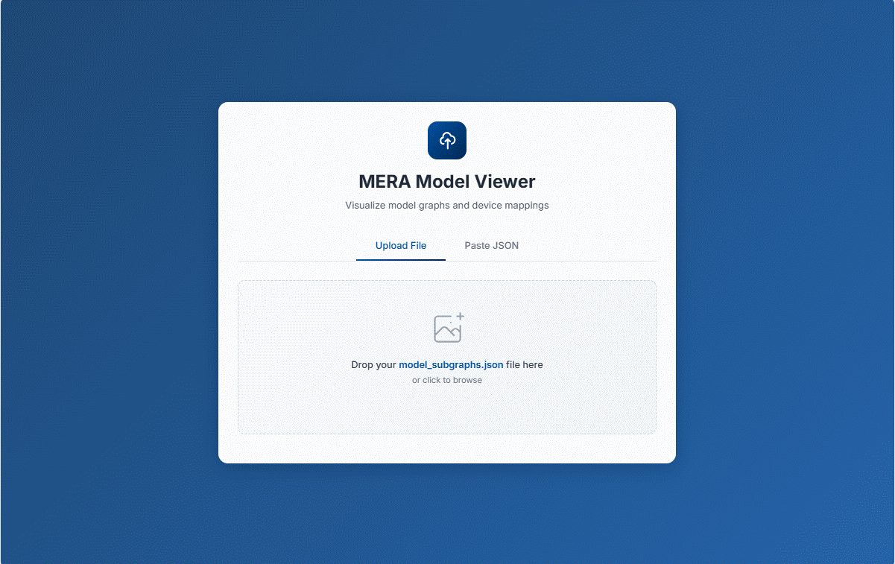
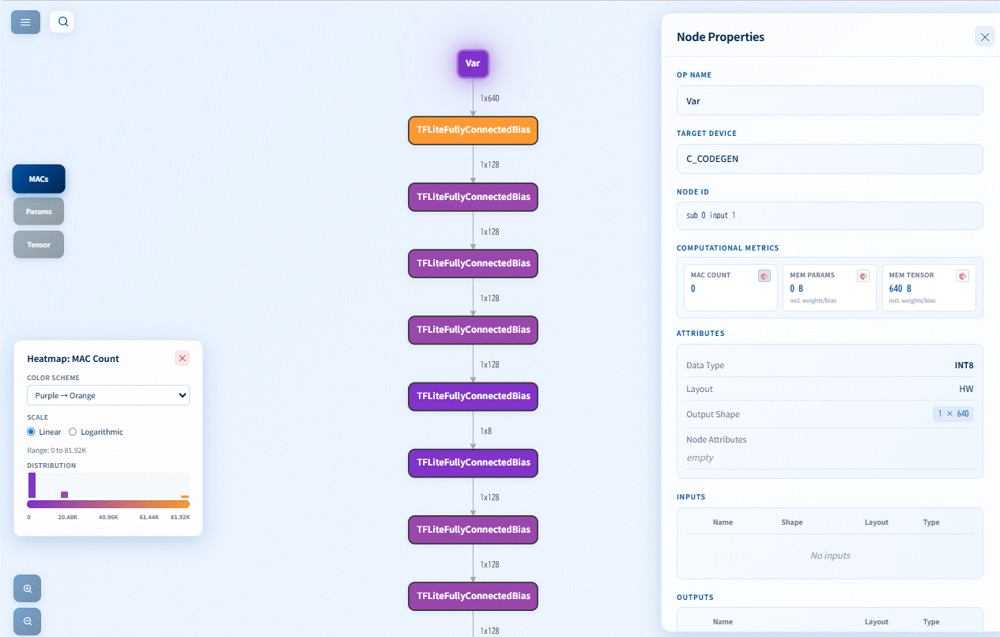

## Visualization tool (MERA Visualizer)  

A model graph visualization tool with interactive web interface for visualizing device compatibility and performance metrics.

### Features
- Model Partitioning Visualization: See which neural network operations map onto what device (e.g., ETHOS_U55, CPU)

- Performance Metrics: Visualize MACs (Multiply-Accumulate operations) and models' by layer metrics with interactive heatmaps

## Installation


Download the installation file from [the directory](../../install/).  
The latest installation file for the visualizer is **mera_visualizer-2.5.0-py3-none-any.whl**

Navigate to working directory and ensure the same virtual environment that was used for [Mera setup](../../install/README.md) is activated and run the installation command.

```
# For the reference, assuming the installation file named as mera_visualizer-2.5.0-py3-none-any.whl
# in the virtual environment on Linux  
pip install mera_visualizer-2.5.0+mcuv3-py3-none-any.whl

# in the virtual environment on Windows
python -m pip install .\mera_visualizer-2.5.0+mcuv3-py3-none-any.whl
```

## Usage  

#### Command Line
Start the MERA Visualizer web server via default port:  

```
mera_visualizer 
```
Run on a custom port:

```
mera_visualizer --port 5566
```

You will see the message like following on your screen.
```
Starting MERA Viewer on http://127.0.0.1:5566
Press Ctrl+C to stop the server
 * Serving Flask app 'mera_viewer.app'
 * Debug mode: off
INFO:werkzeug:WARNING: This is a development server. Do not use it in a production deployment. Use a production WSGI server instead.
 * Running on http://127.0.0.1:5566
INFO:werkzeug:Press CTRL+C to quit
```

Press `Ctrl+C` to stop the server.  

CLI options  
- `--port`, `-p`: Port to run the server on (default: 5000)
- `--host`: Host to run the server on (default: 127.0.0.1)
- `--debug`: Run in debug mode
- `--version`, `-v`: Show version information
- `--help`, `-h`: Show help message
- `--json` : Handling JSON file
  - Load a JSON file directly and start the server   
  mera_visualizer --json path/to/model_subgraphs.json   
  - Load JSON file without opening browser automatically   
  mera_visualizer --json path/to/model_subgraphs.json --no-browser  

## Web Interface  

**Step-1**: Open your browser to http://localhost:5000 (or your custom host/port)  
The web server is displayed in the screen after the installation.  
In this case, the web server is http://127.0.0.1:5566 with referring the display of  "Running on http://127.0.0.1:5566".  
You will see the interface on the browser like below.


**Step-2**: Upload a JSON file using drag & drop or paste JSON data directly.  Explaination where to find JSON file is below.

**Step-3**: Switch between visualization modes:  
You can select the operation mode among MAC count, memory parameters and Memory Tensor.   


#### Input Format  
The tool expects JSON file named model_subgraphs.json.  

The **model_subgraphs.json** is generated during model compilation using MERA. 
If your deployment directory name is **./ad_medium_int8/**, the JSON file might be located inside **./ad_medium_int8/build/MCU**  

```
  ├── ad_medium_int8  
       ├── build  
            ├── MCU  
                ├── [compilation]  
                ├── ********
                ├── model_subgraphs.json   // input file for the visualizer
```

## Requirements  
- Python 3.7+  
- Flask 2.0+  
- NetworkX 2.5+  
- NumPy 1.19+  


