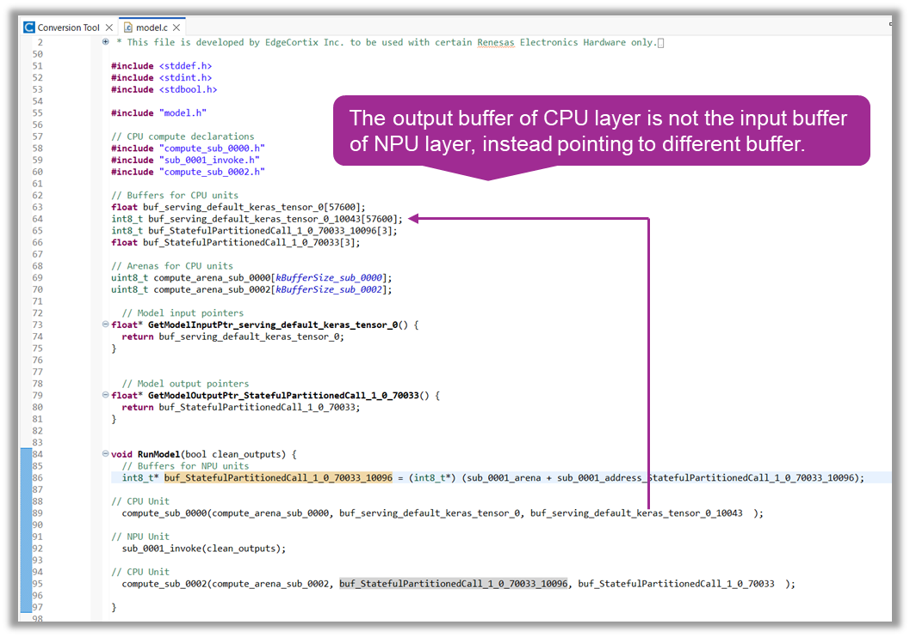
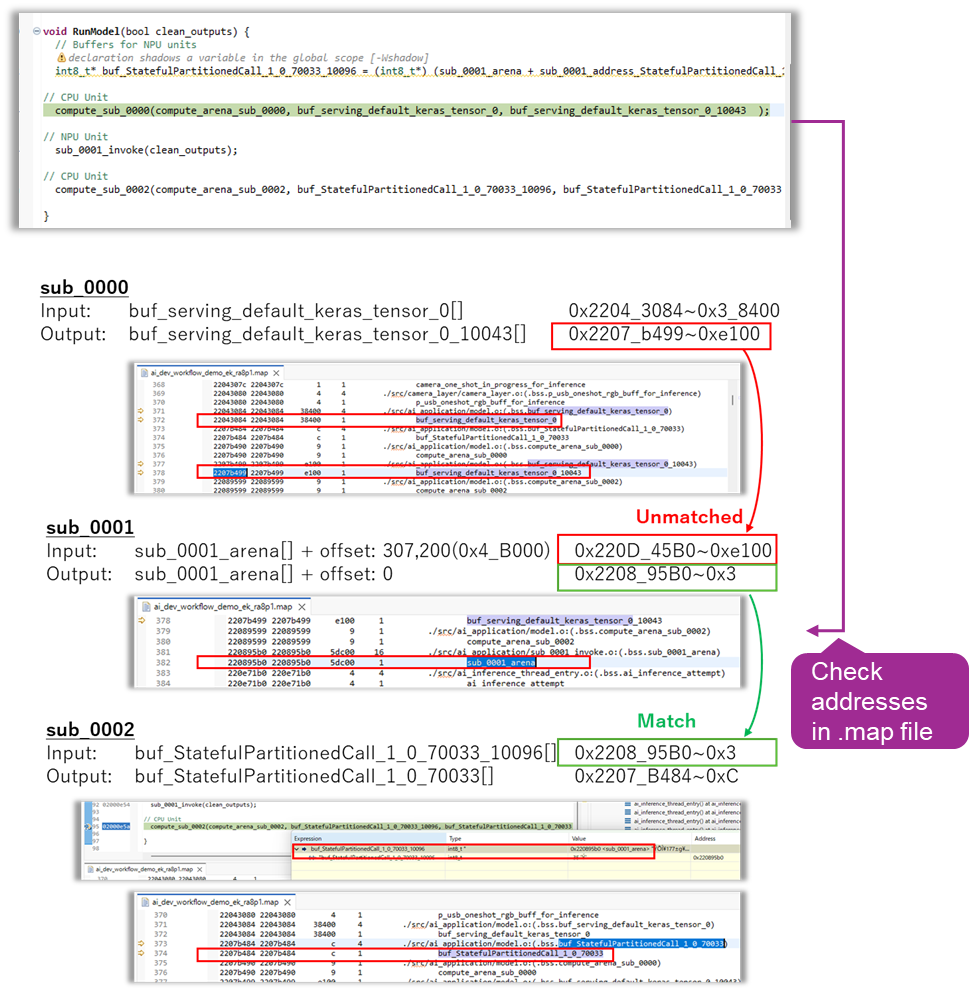
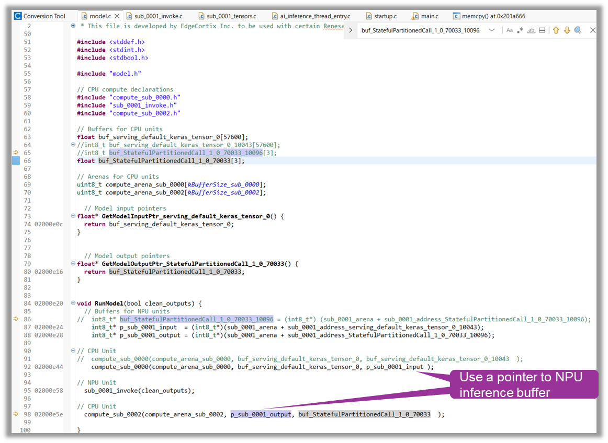

# Partition Boundary Buffer Address Mismatch

## Issue Summary

When a graph is partitioned across different execution subgraphs, the RUHMI generated output buffer for one subgraph may not match the expected input buffer address of the next subgraph.

This can break data handoff between adjacent partitions. One observed case is a CPU layer output not matching the input arena address used by a subsequent NPU invoke.

## How to Detect the Issue

Use the generated memory map (`*.map`) file from the compiled project.

1. Identify a producer function in one partition, for example `compute_sub_0000()`.
2. Identify the consumer function in the next partition, for example `sub_0001_invoke()`.
3. Compare:
   - The output buffer address used by the producer function.
   - The expected input arena or input pointer address used by the consumer function.
4. If these addresses do not match, the partition-to-partition buffer linkage is incorrect.

## Typical Symptom

- Adjacent partition interface uses mismatched input/output addresses between connected subgraphs.
- In map analysis, producer output symbol address and consumer input arena symbol address do not align.

## Suggested Workaround

For affected partition boundaries:

1. Create local buffers with proper alignment to the expected consumer-side input and output addresses.
2. Use the generated `*.map` file to determine the exact producer output and consumer input addresses.
3. Replace RUHMI generated buffers for the affected producer/consumer boundary with these local buffers or pointers.

For the observed CPU -> NPU case:

1. Create a pointer to the NPU input arena address and pass it as the CPU compute output buffer argument.
2. Create a pointer to the NPU output arena address and pass it as the next CPU compute input argument.
3. Validate that function-call buffer pointers and map symbols resolve to the same addresses.

## Visual Evidence

The following captures illustrate the issue and workaround from an observed CPU -> NPU boundary case:

## Notes

- This issue is identified by address mismatch in the memory map, not by topology alone.
- The CPU -> NPU example is one observed manifestation; apply the same verification method to any partition boundary.
- Keep local buffer alignment and placement consistent with target memory region requirements.