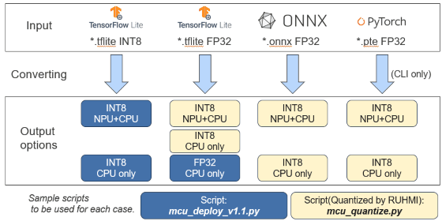

# Model Compilation Scripts

## Introduction

This section introduces how to execute model compilation with the sample scripts for each example case below.

The sample scripts are located [here](../scripts/). You can run each script under the virtual environment showing the prompt like *"(.venv) PS C:\work>"*.

* [Deploy models](#How-to-deploy-models)  
  - Deploy to CPU only   
  - Deploy to CPU with NPU/Ethos U55 supported    
* [Quantize and deploy models](#How-to-quantize-and-deploy-models)
  - Deploy to CPU only   
  - Deploy to CPU with NPU/Ethos U55 supported
* [How to handle multiple models](#How-to-handle-multiple-models)   

## Conversion Options

The scripts provided here support each option. You can use the script depending on the case below.



> [!NOTE]
> Some options have NOT been supported yet. If you see a message like below after running the script, please understand it's not ready yet.

```
If you input the onnx model with the script, mcu_deploy.py, you will receive the message like below.
Quantization to be needed at first.

Found unsupported model files:
  - C:\[working folder]\models_int8\*.onnx

UNAVAILABLE: Feature not available yet. Direct deployment supports only FP32/INT8 .tflite.
For .onnx or .pte, quantize with mcu_quantize.py first.
```

## How to Deploy Quantized Models

The sample script shows how to use the deployment API to compile an already quantized TFLite model on a board with Ethos-U55 support.

This release introduces some tested models. As an example, you can download [ad01_int8.tflite](https://raw.githubusercontent.com/mlcommons/tiny/master/benchmark/training/anomaly_detection/trained_models/ad01_int8.tflite) and [ad01_fp32.tflite](https://raw.githubusercontent.com/mlcommons/tiny/master/benchmark/training/anomaly_detection/trained_models/ad01_fp32.tflite) from [MLCommons](https://github.com/mlcommons).

When running the scripts provided in the repository, you shall build the folder configuration including each model.

The directory configuration for the sample scripts to run is below.
```
  ├── scripts
  |     ├── mcu_deploy.py  // sample script for deploy
  |     └── mcu_quantize.py  // sample script for quantize and deploy
  ├── models_int8                                                                        // To be prepared
  |     └── ad01_int8.tflite  // sample model to input to deployer from MLCommons
  ├── models_fp32                                                                        // To be prepared
  |     └── ad01_fp32.tflite  // sample model to input to Quantizer from MLCommons
  ├── models_fp32_ethos                                                                  // To be prepared
  |     └── ad01_fp32.tflite  // sample model to input to Quantizer from MLCommons
```
> [TIP]
> If you see any warnings in the process below, you can refer to [Tips](../docs/tips.md)

### Deploy to CPU only   
By running the provided script **scripts/mcu_deploy.py**. we can compile the model for MCU only:  
```
cd scripts/  
python mcu_deploy.py --ref_data ../models_int8 deploy_qtzed  
```

### Deploy to CPU with Ethos U55 supported    
When enabling Ethos-U support:  
```
cd scripts  
python mcu_deploy.py --ethos --ref_data ../models_int8 deploy_qtzed_ethos  
 ```

### Check the deploy result

you will get the following results:
```
    deploy_qtzed
    ├── ad01_int8_no_ospi  
```

When Ethos-U support is enabled, each of the directories contain a deployment of the corresponding model for MCU + Ethos-U55 platform:  
```
└── [ad01_int8_no_ospi]  # deployment output example
    ├── build  
        ├── MCU  
            ├── compilation  
                ├── mera.plan  
                ├── src     # C source code and C++ testing support code
                    ├── CMakeLists.txt  
                    ├── compare.cpp  
                    ├── compute_sub_0000.c # CPU subgraph generated C source code  
                    ├── compute_sub_0000.h  
                    ├── ...  
                    ├── ethosu_common.h  
                    ├── hal_entry.c  
                    ├── kernel_library_int.c # kernel library if CPU subgraphs are present  
                    ├── ...  
                    ├── model.c  
                    ├── model.h  
                    ├── model_io_data.c  
                    ├── model_io_data.h  
                    ├── python_bindings.cpp  
                    ├── sub_0001_command_stream.c # Ethos-U55 subgraph generated C source code  
                    ├── sub_0001_command_stream.h  
                    ├── sub_0001_invoke.c  
                    ├── sub_0001_invoke.h  
                    ├── ...  
            ├── deploy_cfg.json  
            ├── ir_dumps  
                ├── *.dot  # IR visualization files
    ├── logs  
    ├── model  
        ├── input_desc.json  
    ├── project.mdp  
```
  
The generated C code under **"build/MCU/compilation/src"** can be incorporated into an e2 studio project.  
You can refer to [Guide to the generated C source code](/docs/runtime_api.md) to study how to use the output files from RUHMI Framework.

## How to Quantize and Deploy Models

If the starting point is a Float32 precision model, it is possible to use the Quantizer to first quantize the model and then deploy with MCU/Ethos-U55 support.
The sample script using the Quantizer can be referred to below.

For an example model, you can use [ad01_fp32.tflite](https://github.com/mlcommons/tiny/blob/master/benchmark/training/anomaly_detection/trained_models/ad01_fp32.tflite) from [MLCommons](https://github.com/mlcommons).

### Deploy to CPU Only

To run the script:
```
cd scripts/  
python mcu_quantize.py ../models_fp32 deploy_mcu   
```

### Deploy to CPU with Ethos-U55 Support
```
cd scripts/  
python mcu_quantize.py -e ../models_fp32_ethos deploy_ethos  
```

### Check the Quantize and Deploy Result

When Ethos-U support is enabled, the output directory structure is similar to the deployment result above, with the quantized model placed in a subdirectory.

The generated C code under **"build/MCU/compilation/src"** can be incorporated into an e2 studio project.  
You can refer to [Guide to the generated C source code](/docs/runtime_api.md) to study how to use the output files from RUHMI Framework.

## How to Handle Multiple Models

Even when multiple models need to be ported into the application, you will convert each model one by one using the same procedure as for a single model. The output functions should be identified by each model to be converted. You can use the `--suffix` option to differentiate them.

**Examples:**
```bash
# Deploy to CPU only
python mcu_deploy.py --suffix _func1 ../models_int8 deploy_qtzed  

# Deploy to CPU with Ethos enabled  
python mcu_deploy.py --ethos --suffix _func1 ../models_int8 deploy_qtzed_ethos  

# Deploy to CPU only after quantization
python mcu_quantize.py --suffix _func1 ../models_fp32 deploy_mcu

# Deploy to CPU with Ethos enabled after quantization
python mcu_quantize.py --ethos --suffix _func1 ../models_fp32_ethos deploy_ethos  
```

The `_func1` suffix in the example is a name you choose to identify each model. The generated functions will include this suffix, allowing you to differentiate between multiple models in your application.


