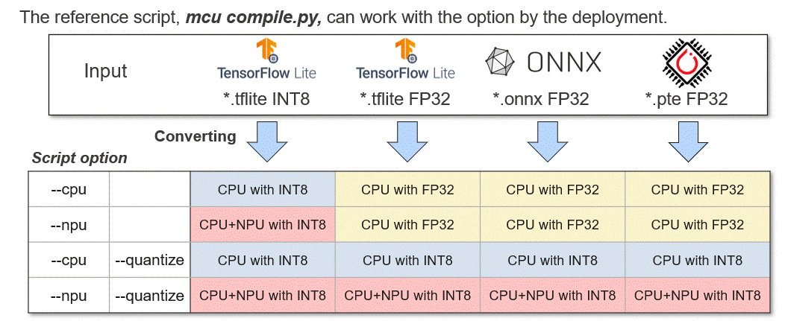

# RUHMI Framework AI MCU Compiler Scripts

This directory contains scripts for compiling and deploying AI models to Renesas RA8xx Microcontrollers (MCU) and Ethos-U NPUs.

## Primary Script: MCU Model Compiler

`mcu_compile.py` is the unified script for compiling and deploying AI models. It handles the whole pipeline: quantization (FP32 -> INT8), C-code generation (MERA/CMSIS-NN/Vela), and optional host-based validation.

**It supersedes the legacy `mcu_deploy.py` and `mcu_quantize.py` scripts.**

### Key Features

1.  **Unified Workflow**: Supports TFLite, ONNX, and PyTorch (Executorch) models.
2.  **Quantization**: Quantizes FP32 models to INT8 using calibration data with --quantize argument.
3.  **NPU Support**: Partitions the graph and compiles ARM Ethos-U55 subgraphs using Vela compiler.
4.  **External Memory**:
    *   **NPU**: `--external` enables Vela's `enable_ospi` flag for OSPI memory placement.
    *   **CPU**: `--external` adds `_external` suffix to the output directory.
    *   **Auto-Detection**: Models larger than `--memory-threshold` auto-trigger external memory mode.
5.  **Host Testing**: `--x86` generates pybind11 bindings for PC testing. `--host-evaluate` runs automated validation.


### Usage

```bash
python mcu_compile.py <model_path> <output_dir> [options]
```

#### Positional Arguments

| Argument | Description |
| :--- | :--- |
| `model_path` | Path to the model file (.tflite, .onnx, .pte) or directory with multiple models to evaluate. |
| `output_dir` | Directory where the generated artifacts will be saved. |

#### Full Argument List

| Argument | Default | Description |
| :--- | :--- | :--- |
| **Target** | | |
| `--npu` | `False` | Compile for Ethos-U55 NPU (Requires INT8 model). |
| `--cpu` | `False` | Compile for Cortex-M CPU (CMSIS-NN). |
| **Precision** | | |
| `--quantize` | `False` | Enable quantization (FP32 -> INT8). |
| `--calib-data` | `None` | Path to calibration data (.npy) for quantization. Random data used if not provided. |
| `--calib-num` | `5` | Number of random calibration samples to generate if no data provided. |
| **Memory & Optimization** | | |
| `--external` | `False` | Force external memory mode. NPU: enables Vela OSPI. CPU: directory naming only. Auto-enabled for large models. |
| `--memory-threshold` | `0.8` | Size threshold (MB) to auto-detect large models requiring external memory. |
| `--memory-mode` | `Sram_Only` | (NPU only) Vela memory mode. Choices: `Sram_Only`, `Shared_Sram`.Choose `Shared_Sram` when the tensor arena access is than weights access (e.g., internal SRAM for the arena, external memory for weights).|
| `--optimization` | `Performance` | (NPU only) Vela optimization target. Choices: `Performance`, `Size`. |
| `--weight-loc` | `Flash` | Weight storage location. Choices: `Flash`, `Iram`. |
| **Output & Naming** | | |
| `--suffix` | `""` | Suffix to append to generating C function names (useful for multiple models). |
| `--result` | `""` | Path to write JUnit XML test results. |
| **Host Testing** | | |
| `--x86` | `False` | Generate x86 pybind11 bindings for manual host testing. |
| `--host-evaluate` | `False` | Build and run on PC to validate accuracy (CPU only, implies --x86). |
| `--ref-data` | `False` | Generate reference input/output data (.npy) for testing on target. |
| **Advanced** | | |
| `--onnx-dims` | `""` | Freeze dynamic ONNX dimensions (e.g., `batch=1,width=224`). |


**Naming Convention:** `{model_name}_{TARGET}[_external][_quantized]`

*   **{model_name}**: Derived from the input file (without extension). Spaces in the filename are replaced with underscores (e.g. `my model.tflite` → `my_model_CPU`).
*   **{TARGET}**: `CPU` or `NPU`.
*   **_external**: Appended if model needs external memory (auto-detected or via `--external`).
*   **_quantized**: Appended if `--quantize` is used.


#### Deployment examples

**For NPU Deployment (Standard):**
```bash
python mcu_compile.py my_model.tflite output/ --npu --quantize
```

**For CPU Deployment (Standard):**
```bash
python mcu_compile.py my_model.tflite output/ --cpu --quantize 
```

**For Large Models (External Memory):**
```bash
python mcu_compile.py my_large_model.tflite output/ --npu --quantize --external
```

**Deploy + Generate x86 bindings for manual testing:**
```bash
python mcu_compile.py my_model.tflite output/ --cpu --x86
```

### Generated Artifact View

The generated output directory contains the generated C code and various artifacts. Here is an example structure for a NPU deployment:

```text
ad_large_int8_npu
└── deploy
    ├── build
    │   └── MCU
    │       ├── ad_large_int8_after_canonicalization.dot
    │       ├── ad_large_int8_subgraphs.dot
    │       ├── compilation
    │       │   ├── mera.plan
    │       │   ├── src  --> **Where the source code lives**
    │       │   │   ├── ethosu_common.h
    │       │   │   ├── hal_entry.c
    │       │   │   ├── model.c
    │       │   │   ├── model.h
    │       │   │   ├── sub_0000_command_stream.c
    │       │   │   ├── sub_0000_command_stream.h
    │       │   │   ├── sub_0000_invoke.c
    │       │   │   ├── sub_0000_invoke.h
    │       │   │   ├── sub_0000_model_data.c
    │       │   │   ├── sub_0000_model_data.h
    │       │   │   ├── sub_0000_tensors.c
    │       │   │   ├── sub_0000_tensors.h
    │       │   │   └── sub_0000__ARM_ETHOS_U55_C_CODEGEN    
    │       ├── constants
    │       ├── deploy_cfg.json
    │       ├── io_desc.json
    │       ├── ir_dumps
    │       └── model_subgraphs.json --> **JSON file for mera_visualizer**
    ├── logs
    ├── model
```

The generated C code under **"build/MCU/compilation/src"** can be incorporated into an e2 studio project.  
You can refer to [Guide to the generated C source code](/docs/runtime_api.md) to study how to use the output file from AI MCU compiler.  


### Helper Utilities

#### Model Metrics Analysis (`scripts/utils/check_model_metrics.py`)

A helper script is provided to analyze memory usage (RAM/Flash) and operation counts (MACs) of compiled models.

```bash
python scripts/utils/check_model_metrics.py <path_to_deploy_dir>
```

See [scripts/utils/README.md](utils/README.md) for more details.


### How to Handle Multiple Models

When porting multiple models into a single application, you must convert each model individually. To avoid naming conflicts in the generated C code, you should assign a unique suffix to each model's output functions using the `--suffix` option.

**Example:**

```bash
# Deploy Model A (CPU only) with suffix "_func1"
python mcu_compile.py model_a.tflite deploy_output/ --cpu --quantize --suffix _func1

# Deploy Model B (NPU enabled) with suffix "_func2"
python mcu_compile.py model_b.tflite deploy_output/ --npu --quantize --suffix _func2
```

This ensures that the generated functions (e.g., `compute_sub_0000_func1`, `compute_sub_0000_func2`) have unique names and can coexist in the same project.

---


## ⚠️ Legacy Scripts (Deprecated)

The following information applies to `mcu_deploy.py` and `mcu_quantize.py`. These scripts are maintained for backward compatibility but will be removed in future releases.

### Legacy Introduction

The sample scripts showed how to execute model compilation for specific cases.
You can run each script under the virtual environment showing the prompt like *"(.venv) PS C:\work>"*.

### Legacy: Conversion options
The introduced scripts here supports each option. You can use the script depending on the case below.


[NOTICE]
Some options has NOT been supported yet. If you have seen the message like below after runingn the script, please understand it's not ready yet.

```
If you input the onnx model with the script, mcu_deploy.py, you will receive the message like below.
Quantization to be needed at first.

Found unsupported model files:
  - C:\[working folder]\models_int8\*.onnx

UNAVAILABLE: Feature not available yet. Direct deployment supports only FP32/INT8 .tflite.
For .onnx or .pte, quantize with mcu_quantize.py first.
```

### Legacy: How to deploy quantized models  
[For use with `mcu_deploy.py`]

The sample script shows how to use the deployment API to compile an already quantized TFLite model on a board with Ethos-U55 support.  

This release introduces some tested models. As the example model,we can download [ad01_int8.tflite](https://raw.githubusercontent.com/mlcommons/tiny/master/benchmark/training/anomaly_detection/trained_models/ad01_int8.tflite) and [ad01_fp32.tflite](https://raw.githubusercontent.com/mlcommons/tiny/master/benchmark/training/anomaly_detection/trained_models/ad01_fp32.tflite) from [MLCommons](https://github.com/mlcommons)    
When runing the scripts provided in the repository, you shall build the folder configuration including each model.  

The directory configuration for the sample scripts to run is below.
```
  ├── scripts
  |     ├── mcu_deploy.py  // sample script for deploy
  |     └── mcu_quantize.py  // sample script for quantize and deploy
  ├── models_int8                                                                        // To be prepared
  |     └── ad01_int8.tflite  // sample model to iput to deployer from MLCommons
  ├── models_fp32                                                                        // To be prepared
  |     └── ad01_fp32.tflite  // sample model to input to Quantizer from MLCommons
  ├── models_fp32_ethos                                                                  // To be prepared
  |     └── ad01_fp32.tflite  // sample model to input to Quantizer from MLCommons
```
>[!TIP]
>If you see any warnings in the process below, refer to [Known Issues](../docs/known_issues/README.md)

#### Deploy to CPU only   
By running the provided script **scripts/mcu_deploy.py**. we can compile the model for MCU only:  
```
cd scripts/  
python mcu_deploy.py --ref_data ../models_int8 deploy_qtzed  
```

#### Deploy to CPU with Ethos U55 supported    
When enabling Ethos-U support:  
```
cd scripts  
python mcu_deploy.py --ethos --ref_data ../models_int8 deploy_qtzed_ethos  
 ```

#### Check the deploy result

you will get the following results:
```
    deploy_qtzed
    ├── ad01_int8_no_ospi  
```

When Ethos-U support is enabled, each of the directories contain a deployment of the corresponding model for MCU + Ethos-U55 platform:  
```
└── [ad01_int8_no_ospi]  # an example for "ad01_int8_no_ospi"  
    ├── build  
        ├── MCU  
            ├── compilation  
                ├── mera.plan  
                ├── src     # compilation results: C source code and C++ testing support code # HAL entry example  
                    ├── CMakeLists.txt  
                    ├── compare.cpp  
                    ├── compute_sub_0000.c # CPU subgraph generated C source code  
                    ├── compute_sub_0000.h  
                    ├── ...  
                    ├── ethosu_common.h  
                    ├── hal_entry.c  
                    ├── kernel_library_int.c # kernel library if CPU subgraphs are present  
                    ├──  ...  
                    ├── model.c  
                    ├── model.h  
                    ├── model_io_data.c  
                    ├── model_io_data.h  
                    ├── python_bindings.cpp  
                    ├── sub_0001_command_stream.c # Ethos-U55 subgraph generated C source code  
                    ├── sub_0001_command_stream.h  
                    ├── sub_0001_invoke.c  
                    ├── sub_0001_invoke.h  
                    ├──  ...  
                ├──  ...  
            ├── deploy_cfg.json  
            ├── ir_dumps  
                ├── person-det_can.dot  
                ├── ...  
            ├── person-det_after_canonicalization.dot  
            ├── person-det_subgraphs.dot  
    ├── logs  
    ├──　model  
        ├── input_desc.json  
    ├── project.mdp  
```
  
The generated C code under **"build/MCU/compilation/src"** can be incorporated into a e2studio project.  
You can refer to [Guide to the generated C source code](/docs/runtime_api.md) to study how to use the output file from RUHMI Framework.  

### Legacy: How to quantize and deploy models 
[For use with `mcu_quantize.py`]

If the starting point it is a Float32 precision model, it is possible to use the Quantizer to first quantize the model and finally deploy with MCU/Ethos-U55 support.
The sample script with using the Quantizer can be refered.

For an example model, the same model in FP32 shall be used [ad01_fp32.tflite](https://github.com/mlcommons/tiny/blob/master/benchmark/training/anomaly_detection/trained_models/ad01_fp32.tflite) from  [MLCommons](https://github.com/mlcommons)  


#### Deploy to CPU only   

To run the script:
```
cd scripts/  
python mcu_quantize.py ../models_fp32 deploy_mcu   
```

#### Deploy to CPU with Ethos U55 supported   
```
cd scripts/  
python mcu_quantize.py -e ../models_fp32_ethos deploy_ethos  
```

#### Check the quantize and deploy result   

When Ethos-U support is enabled, each of the directories contain a deployment of the corresponding model for MCU + Ethos-U55 platform.
(Structure is similar to `mcu_deploy.py` output).

### Legacy: How to deploy FP32 model (Not quantized model)

RHUMI framework supports to deploy a Float32 precision model without quantization in case of the conversion for CPU only. That means Ethos-U55 does not work. 
You will use the option of *"--fp32"* with the script of mcu_quantize.py.

To run the script:
```
cd scripts/  
python mcu_quantize.py --fp32 ../models_fp32 deploy_mcu   
```
Handling the output files is same as the conversion above.

### Legacy: How to handle multiple models
Even the case of multiple models to be ported in the application, you will convert each model one by one by the same procedure for single model. The output functions should be identified by each model to be converted. You can use the option adding "--suffix"

The example below.
```
# to deploy to CPU only
python mcu_quantize.py --suffix _func1 ../models_fp32 deploy_mcu

#to deploy to CPU with Ethos enabled
python mcu_quantize.py -e --suffix _func1 ../models_fp32_ethos deploy_ethos  
```
The description of func1 in the example means the name to identified for you.
You can get the functions which are identified with the suffix you set added. How to port is same as the standard usage.
